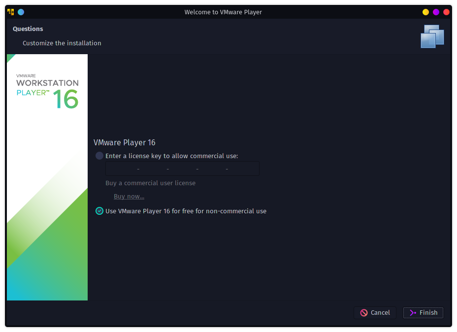
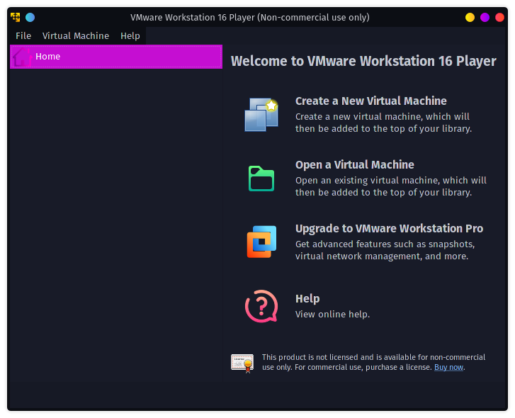

# （Arch Linux上に）VMwareのインストール

Arch Linuxというか自分はGaruda Linuxだけども似たようなものということで。

## 手順

ターミナル上で以下を打つ。

~~~shell
$ sudo pacman -S vmware-workstation
~~~

起動は以下。

~~~shell
$ vmplayer
~~~

そうすると以下の画面が立ち上がる。画面デザインはディストロによって色々。以下GUIベース。

とりあえずnon-commercial useを選んで`Finish`ボタンを押す。

するといきなり初期画面に移る。

これでインストールされたっぽいので、次からはターミナルから立ち上げるか、適当にアプリケーション一覧から探して立ち上げたら良い。
