# （Windows上に）VMwareのインストール

なぜメインPCのOSがLinuxなのに、Windowsにインストールするのか。それは内緒。

## 手順

### インストーラーをダウンロード

「vmware workstation player」とかで検索して、VMwareのダウンロードサイトへアクセス。

「無償ダウンロード」をクリック

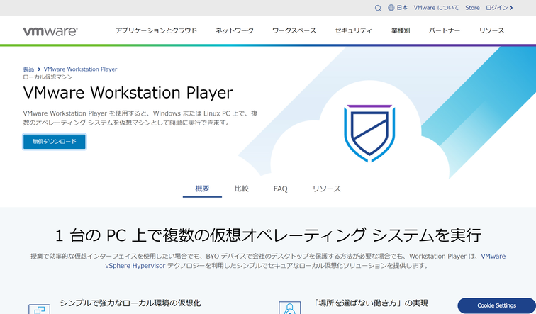

「GO TO DOWNLOADS」をクリック。

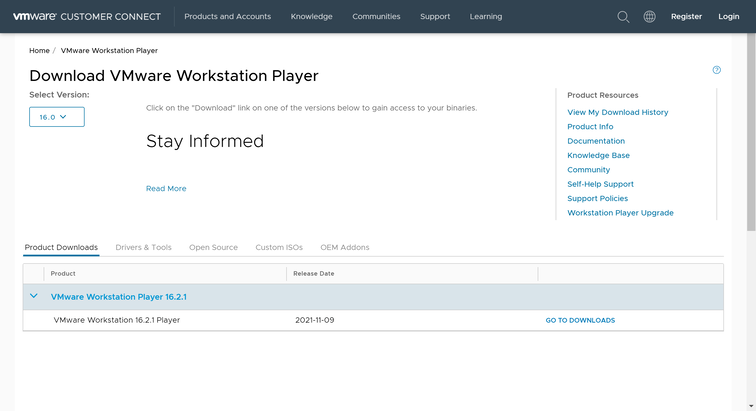

Windowsのインストーラーっぽいものをダウンロード。

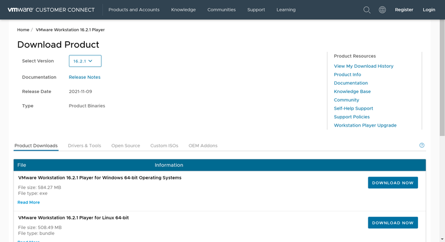

### インストール

基本的には画面に従うだけ。

途中で以下のことを聞かれる。

* Windows Hypervisor Platform (WHP)の自動インストール　→　入れる
* 拡張キーボードドライバ　→　大した機能ではないらしいからインストールしない

ぐらい。後は好み。

以下画面。

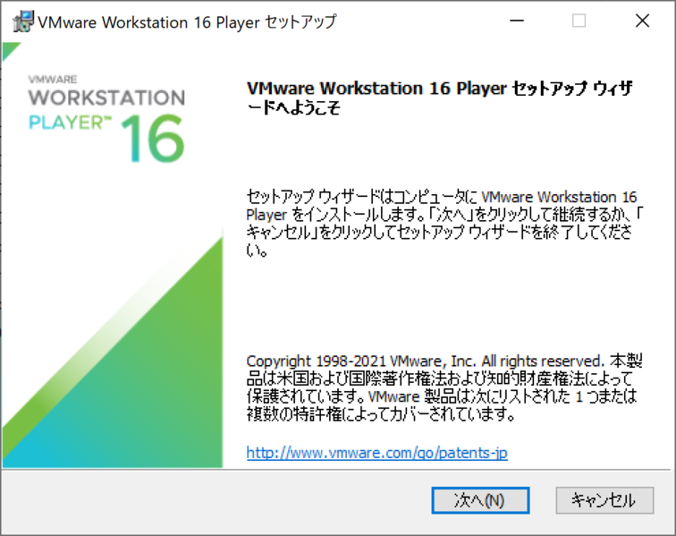

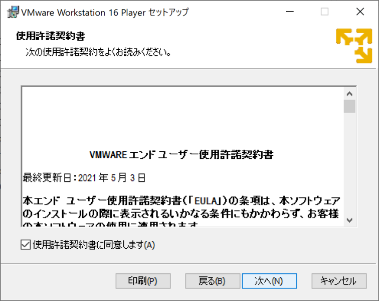

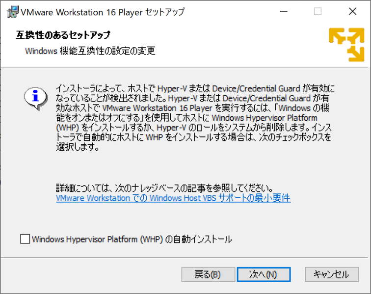

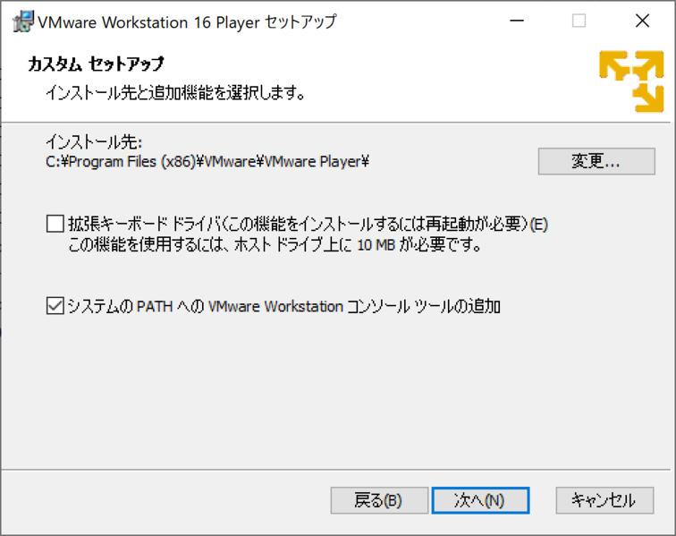

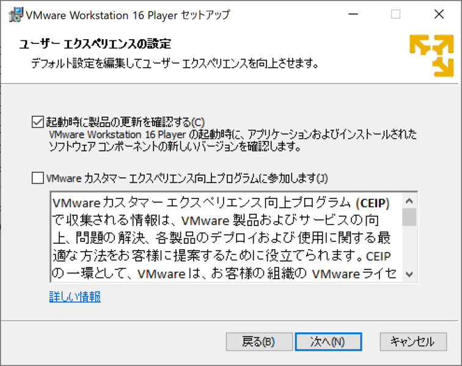

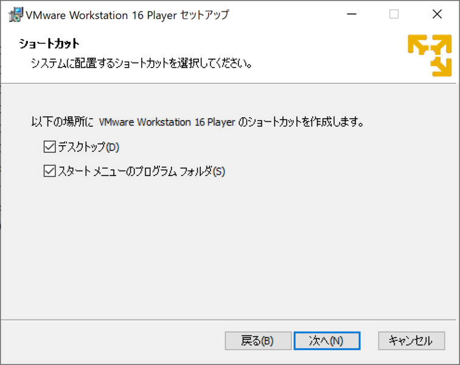

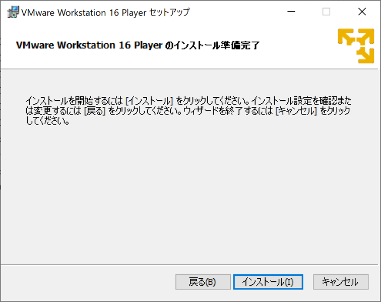

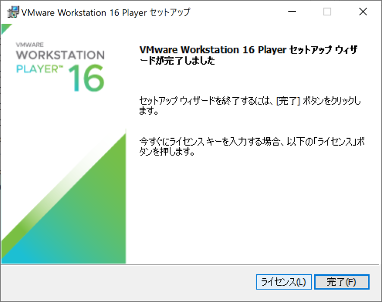

### 起動

適当にインストールするとデスクトップにショートカットができているのでダブルクリックすると起動する。

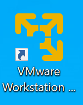

非営利で。

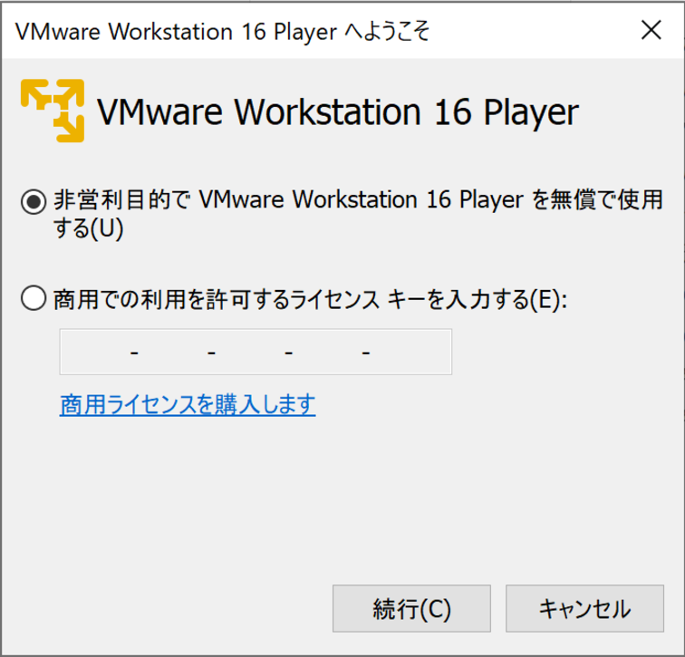

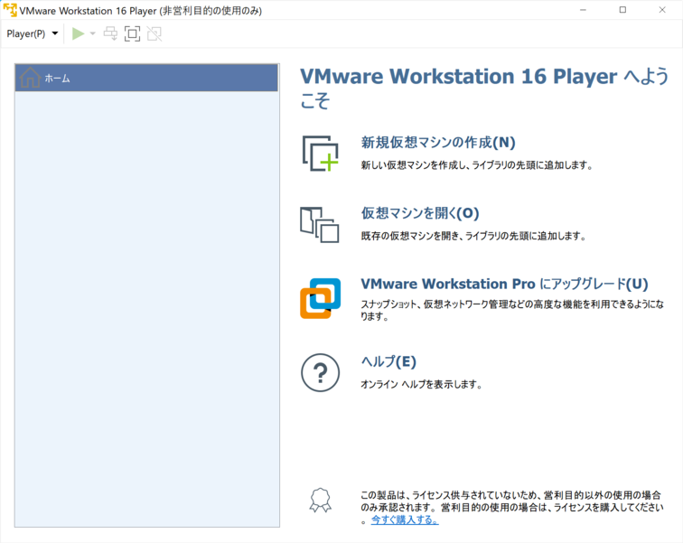

ここまで来たらLinux版と同じはず。
