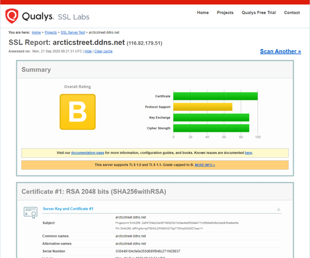

# URLを`https://`でもアクセスできるようにする（Let's Encrypt使用）

現状は`http://`でないとアクセスできなくて、それをするとChromeから「安全でない可能性が～」みたいなことを言われる。

HTTPとHTTPSの違いは「httpsとは」とかで検索すると詳しい解説が出てくるのでそちらに譲るとして、ざっくり説明すると

1. クライアント（PCやスマホ）とWebサーバーの間の通信を暗号化すること
2. サーバーの運営者が誰であるかを証明すること

2.については解説にちょっとだけ説明を書いておく。

## やりたいこと

`https://arcticstreet.ddns.net`でもアクセスできるようにする。

## 環境

+ リモート（Raspberry Pi）
  * Raspberry Pi 3B+
  * Raspberry Pi OS 10.4
  * Nginx 1.14.2

## 前提

### Let's Encryptとは

> Let's Encryptは、**無料**で**[SSL証明書](http://d.hatena.ne.jp/keyword/SSL%BE%DA%CC%C0%BD%F1)を取得**することが出来るサービスです。
>
> (中略)
>
> [SSL証明書](http://d.hatena.ne.jp/keyword/SSL%BE%DA%CC%C0%BD%F1)とは、**[https](http://d.hatena.ne.jp/keyword/https)での通信を可能にする**ために必要なものです。
>
> [Let's Encryptとはなにか、について調べる \- たけぼーの備忘録](https://tks-lab.hatenablog.com/entry/2017/08/07/160000)

### Certbotとは

> `certbot`コマンド(旧称letsencrypt)は、公的な認証局[Let's Encrypt](https://letsencrypt.org/)が発行する無料のTLSサーバ証明書を、簡単なコマンド操作で取得・更新できる、革命的なオープンソースソフト。
>
> (中略)
>
> ちまたで言うSSLは今は技術的に発展したTLSのこと。これに対応したサイトのURLが`https://`で始まるので、HTTPSとも呼ばれる。以降TLSと表記する。
>
> [Certbot\(Let's Encrypt\)入門](https://certbot.open-code.club/)

## 方法

### ポートフォワーディングの設定

やり方は[以前の記事](../startup/portforwarding.html)を参照。外部から待ち受けるポートをTCPの443番とし、宛先がRaspberry PiのIPと443番ポートになるようにする。

### CertbotのインストールとHTTPS化

[Certbot \- Debianbuster Nginx](https://certbot.eff.org/lets-encrypt/debianbuster-nginx)に従う。

#### SSH接続でRaspberry PiにログインしてCertbotをインストールする

~~~shell
$ sudo apt-get install certbot python-certbot-nginx
~~~

#### CertbotにNginxの設定をしてもらう

~~~shell
$ sudo certbot --nginx
Saving debug log to /var/log/letsencrypt/letsencrypt.log
Plugins selected: Authenticator nginx, Installer nginx
Enter email address (used for urgent renewal and security notices) (Enter 'c' to
cancel):
~~~

コマンドを入力すると聞かれるもの

1. メールアドレス

   緊急の更新とセキュリティ通知に使うらしい。空白のまま進むと「メールアドレスを入力するか`--register-unsafely-without-email`オプションを付けてね。でも`/etc/letsencrypt/accounts`にあるアカウントキーを絶対にバックアップしておいてね。」と言われる。メールアドレス入力無しで運用したらどういうことになるのか調べてもいいけど、とりあえず今回はメールアドレスを入力することにする。

2. 規約の同意

3. Electronic Frontier Foundation（Let's Encryptプロジェクトの共同出資者でCertbotの開発元）へのメールアドレスの提供

4. HTTPS化するドメイン

   ざっくり言うとURLのこと。自分は`arcticstreet.ddns.net`と入れた。後で「おめでとう！`https://arcticstreet.ddns.net`が有効化されました！」と出るので、サブドメインやホスト名も含めたFQDN（Fully Qualified Domain Name、完全ドメイン）を入力しないといけない。

5. HTTP接続をHTTPS接続にリダイレクトするか

   `2: Redirect`を選択すると、`http://arcticstreet.ddns.net`でアクセスしても自動的に`https://arcticstreet.ddns.net`に変わる。

#### `/etc/letsencrypt`ディレクトリをバックアップ

しろと言われるのでする。ラズパイ内にバックアップを作るのと、念のためローカルにダウンロードしておく。いくつかのファイルが権限の関係で`scp`でダウンロードできないのでzip圧縮して転送する。

1. バックアップ用ディレクトリを作りそこへコピー＆確認

     ~~~shell
   $ mkdir ~/backup
   $ sudo cp -r /etc/letsencrypt ~/backup
   $ cd ~/backup
   $ ls
   letsencrypt
   ~~~

2. zipコマンドをインストールし、letsencryptディレクトリをzip圧縮

    ~~~shell
    $ sudo apt-get update
    $ sudo apt-get install zip
    $ sudo zip -r -y letsencrypt.zip letsencrypt
    ~~~

3. ローカルから`scp`コマンドでローカルにletsencrypt.zipをダウンロード

    ~~~shell
    > scp -P (ポート番号) (ユーザー名)@(ラズパイのIP):~/backup/letsencrypt.zip (保存先フォルダのフルパス)
    ~~~

もしこのバックアップから復旧させる必要がある場合、やり方はここが参考になるかも。

[サーバー移転（引越し）でLet’s Encrypt 「SSL/TLSサーバ証明書」はどうする？](https://blog.fileshelfplus.com/vps/280)

#### HTTPS化ができているかどうか確認

`https://www.ssllabs.com/ssltest/analyze.html?d=(自分の完全ドメイン)`にアクセスするとHTTPS化できているかどうか、よく分からない分析も含めて表示してくれる。

[SSL Server Test: arcticstreet\.ddns\.net \(Powered by Qualys SSL Labs\)](https://www.ssllabs.com/ssltest/analyze.html?d=arcticstreet.ddns.net)

### 証明書の有効期限が切れるまでにちゃんとCertbotが動いてくれるのか確認

公式HPには「有効期限切れになる前にちゃんと証明書を自動で更新するから、あなたがもう一度Certbotを起動する必要はありませんよ」と言っているが、それならどこかにそういう設定があるはず。

~~~shell
$ systemctl list-timers | grep certbot
Tue 2020-09-22 00:52:26 JST  3h 37min left n/a                          n/a       certbot.timer                certbot.service
~~~

あった。

もっと調べてみるとこのタイマーは`/lib/systemd/system/certbot.timer`というファイルで定義されている。

~~~shell
$ cat /lib/systemd/system/certbot.timer
[Unit]
Description=Run certbot twice daily

[Timer]
OnCalendar=*-*-* 00,12:00:00
RandomizedDelaySec=43200
Persistent=true

[Install]
WantedBy=timers.target
~~~

毎日0時（午前、午後問わず）になった瞬間`/lib/systemd/system/certbot.service`を実行する。

~~~shell
$ cat /lib/systemd/system/certbot.service
[Unit]
Description=Certbot
Documentation=file:///usr/share/doc/python-certbot-doc/html/index.html
Documentation=https://letsencrypt.readthedocs.io/en/latest/
[Service]
Type=oneshot
ExecStart=/usr/bin/certbot -q renew
PrivateTmp=true
~~~

`/lib/systemd/system`ディレクトリにあるものはシステム起動時に全て読み込まれるっぽい。

> このセクションは `PID=1` (詰まり、init プロセス)の systemd(1) プログラムがどのようにシステムを起動するのかを説明します。`systemd` の init プロセスは、SysV 的な手続き定義スタイルではなく宣言定義スタイルで書かれた unit 設定ファイル(systemd.unit(5) 参照 )に従い並列で複数プロセスを起動します。これらは以下に記すような複数のパス (systemd-system.conf(5) 参照)から読み込まれます:
>
> * "`/lib/systemd/system`": OS のデフォルトの設定ファイル
> * "`/etc/systemd/system`": OS デフォルト設定ファイルをオーバーライドするシステム管理者設定ファイル
>
> [第3章 システムの初期化](https://www.debian.org/doc/manuals/debian-reference/ch03.ja.html)

ちなみに`systemctl -t timer`というコマンドでも確認できるらしい。以下は`grep`コマンドで`certbot`という文字列がある行を抽出している。

~~~shell
$ systemctl -t timer | grep certbot
certbot.timer                loaded active waiting Run certbot twice daily
~~~

## 解説

### HTTPSを使うことが「サーバーの運営者が誰であるかを証明すること」になる理由

どうやったら今アクセスしているWebサーバーが「正しいWebサーバーなのか」を確認できるか、という話。

「大体こんな感じ」という雰囲気で書いているので、細かいところで間違えてるかもしれないけど、そこは容赦してください。

#### そもそも暗号化されていなかったら

HTTPでは通信は暗号化されていない。なので悪意を持った人（以下悪者）が通信を傍受して盗み見することができるし、なんならその通信内容を改ざんすることもできる。

改ざんが厄介で、例えばあなたが友人のWebサイトを見に行ったときに悪意を持った人がその通信を傍受して、トップページにエロ画像がバーンと表示されるように改ざんしたとしたら・・・「なにコイツ、バカ？」と思われ「いや、ちょっとこんな常識の無いやつと関わるのをやめよう」みたいなことになって、人間関係が壊れるとかいうことが起こる。

だから「ウチはカード情報みたいな漏れたらヤバい情報扱ってないし暗号化しなくても大丈夫」という問題では無い。

#### 暗号化するだけじゃダメ

じゃあその友人が通信を暗号化していたら大丈夫なのか。

悪者はその友人のサイトそっくりのWebサイトを作って、同じように通信も暗号化もして、あなたにこう言います。

「URL変えたよ。ちょっと見てみて」

そしてエロ画像バーン。

この場合、サーバーは友人が持っているサーバーではないWebサーバーに誘導されている。もし友人サーバーに「その友人によって運営されているサーバーだ」という証明書があれば、あなたはそれを確かめるだけで「このエロ画像バーンサイトは友人のサーバーではないな」と安心することができる。

暗号化と証明書がセットになって初めて信頼性が確保される。なのでHTTPSを使うにはこの2つをセットにしようとどこか偉い人が決めた。

#### 証明書は意味を持つのか

でもここでこの「友人によって運営されているサーバー」という証明書まで偽装されていたらどうか。この場合は「誰に証明してもらったか」で差をつけることになる。例えば本物は「会社の上司に認めてもらいました」というお墨付きがついているとする。

でもあなたはその会社の上司のことを知らない。その会社は大丈夫な会社なのか？というかその会社はその友人が勤めている会社なのか？そもそもその証明書とその会社の上司云々の話すべてが嘘だったら・・・

こうなると訳が分からなくなり、証明書があったとしても意味が無くなってしまう。

でもこれが会社の上司とかそういうよく分からない人じゃなくて「役所に認めてもらいました」だったどうなるか。

誰もが認める公的機関の役所がきっちり本人確認をして「確かにその友人がそのWebサーバーを運営していますよ」という証明を発行していたら、それならまあ信用してもいいかもしれない、となる。

つまり証明書は「信用できる機関が証明した」ものでないと意味を持たない。

#### 意味のある証明書を入手するにはお金がかかる

実際の役所はそんな仕事をしていないし、そもそもインターネットには国境がないので日本の役所のお墨付きをもらったところで海外の人たちにとってはあまり意味がない。日本だったら国際的にも役所の厳密性は認められてそうな感じだけど、役所の仕事がザルな国もあるだろうし、役所で判断するのは難しい。

なので、インターネット上に全世界的に認められているとされる公的機関（＝認証局と呼ばれる）を作ってそこがお墨付きを与えるような仕組みがある。

お墨付きを与えるために認証局は場合によっては身元確認だったり申請してきた組織の実態調査をしたりする。当然彼らは仕事でそういうことをやっているので、そのお墨付きをもらうためにはお金が必要。

#### Let's Encryptが発行する証明書はあくまで「このドメインはLet's Encryptに登録されました」ということを保証するだけ

この記事ではHTTPS化を無料でやることを書いたけど、無料で証明書を取ってる以上その認証局は無料で誰にでも発行しているわけで、その管理者が信頼できるかどうかということは調べない。

でもHTTPSは、説明した通り証明書と暗号化をセットにするもの、せめて改ざんを防ぎたくて暗号化はしておきたいという場合、管理者の信頼性は証明されないことを承知の上でLet's Encryptに登録する、というわけ。

