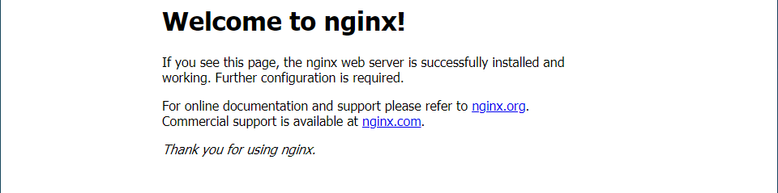
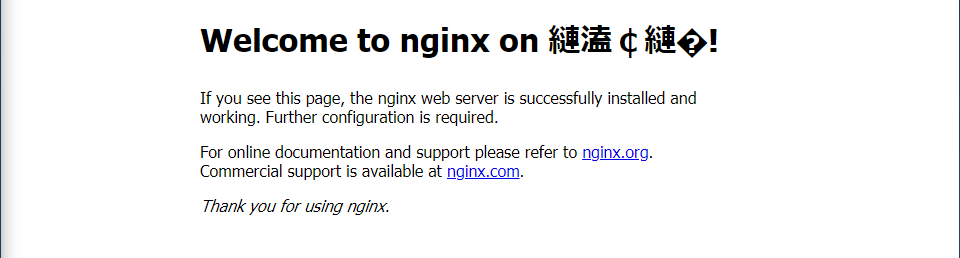
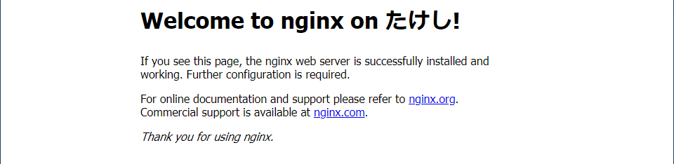
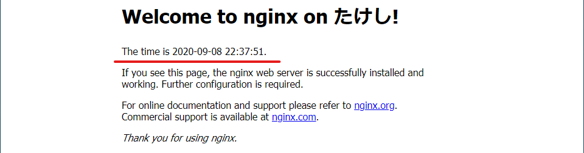

# Webサーバー(Nginx)をインストールし、HTMLファイルを外部に公開

## やりたいこと

WebサーバーであるNginxをインストールして、HTMLファイルを公開する。

## 環境

- ローカル（PC側）
  - Windows10
  - PowerShell 5.1
- リモート（Raspberry Pi）
  - Raspberry Pi 3B+
  - Raspberry Pi OS 1.4

## 概要

NGINX + PHP
[Setting up an NGINX web server on a Raspberry Pi – Raspberry Pi Documentation](https://www.raspberrypi.org/documentation/remote-access/web-server/nginx.md)

世の中的にはApacheの方が有名？

Apache + PHP
[Setting up an Apache Web Server on a Raspberry Pi – Raspberry Pi Documentation](https://www.raspberrypi.org/documentation/remote-access/web-server/apache.md)

## 方法

### Nginxのインストール

Raspberry Piにログインして以下を打つ。

```shell
$ sudo apt update
$ sudo apt install nginx
$ sudo /etc/init.d/nginx start
```

ブラウザにRaspberry PiのローカルIPを入力すると



このHTMLファイルは`/var/www/html`フォルダにあるが、nanoでいじってみようと思ったら書き込み禁止になってる。

```shell
$ cd /var/www/html
$ ls -al
total 12
drwxr-xr-x 2 root root 4096 Sep 8 21:53 .
drwxr-xr-x 3 root root 4096 Sep 8 21:53 ..
-rw-r--r-- 1 root root 612 Sep 8 21:53 index.nginx-debian.html
```

所有者がrootになっているので乗っ取る。

```shell
$ sudo chown (ユーザー名): index.nginx-debian.html
```

nanoで`index.nginx-debian.html`を開き、適当に編集し保存。

再度ブラウザからRaspberry Piにアクセスする。



これはマズイ。HTML初心者ということがバレる。

`index.nginx-debian.html`を再度開き、HEADタグ内に以下を記入。

```
<meta http-equiv="content-type" charset="utf-8">
```



よし。

### PHPを試す

PHPについてはまた今度解説する。とりあえずインストールをしておく

```shell
$ sudo apt install php-fpm
```

Nginxの設定ファイルを開く。

~~~shell
$ cd /etc/nginx
$ sudo nano sites-enabled/default
~~~

* 25行目辺りに

  ~~~
  index index.html index.htm;
  ~~~

  と書かれた行があるので、以下に書き換える。

  ~~~
  index index.php index.html index.htm;
  ~~~

* さらに下にスクロールし、以下の記述を見つける

  ~~~
  # pass the PHP scripts to FastCGI server listening on 127.0.0.1:9000
  #
  # location ~ \.php$ {
  ~~~

  この`location`の頭の`#`を取り、さらにその下の行の`#`も、必要な部分取っていく。以下のようになればよい。

  ~~~
          # pass the PHP scripts to FastCGI server listening on 127.0.0.1:9000
          #
          location ~ \.php$ {
                  include snippets/fastcgi-php.conf;
  
          # With php-fpm (or other unix sockets):
          fastcgi_pass unix:/var/run/php/php7.0-fpm.sock;
          # With php-cgi (or other tcp sockets):
      #    fastcgi_pass 127.0.0.1:9000;
          }
  ~~~

Nginxを再読み込み。

~~~shell
$ sudo /etc/init.d/nginx reload
~~~

これでPHP7のインストールと有効化が設定された。

先ほどのHTMLファイルをリネーム。

```shell
$ cd /var/www/html
$ sudo mv index.nginx-debian.html index.php
```

`index.php`をnanoで開き、BODYタグ内の適当な場所にPHPのコードを埋め込む。

```php
<p>The time is <?php echo date('Y-m-d H:i:s'); ?>.</p>
```



赤線の部分がPHPで動的に変わる部分。リロードするとその都度時刻が変わる。

### 外部ネットワークからもアクセスできるようにポートを開放する

Webサーバーに使うポートは80番。以前やった[ポートフォワーディング](../startup/portforwarding.html)と同じやり方で、外部から待ち受けるポートをTCPの80番ポートとし、宛先をRaspberry PiのIPと80番ポートになるように設定する。

確認はWifi切ったスマホのブラウザに、

~~~
http://(取得したドメイン)
~~~

を入力したらできる。うまく設定できていたら同じHTMLファイルが表示される。