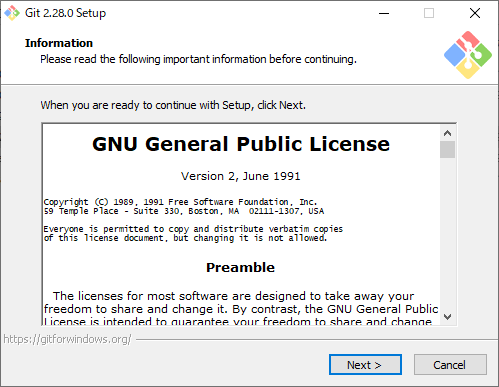

# HTML更新（Gitを使う）

ローカルで削除したファイルは、やっぱりリモート上でも削除したい。そんな同期を目指すなら結局Gitが最強。メインPCとノートPCでHTMLを更新する2PC運用もできる。

## やりたいこと

HTMLファイルをGit管理して、Pushしたら

1. Raspberry Piに直接転送される
2. GitHubに転送され、Raspberry Piが定期的にPullする

のどちらかをする。今回は1.を行う。

## 環境

- ローカル（PC側）
  - Windows10
  - PowerShell 5.1
  - Git version 2.28.0.windows.1
- リモート（Raspberry Pi）
  - Raspberry Pi 3B+
  - Raspberry Pi OS 10.4
  - Git version 2.20.1

## 前提

### Gitとは

とりあえずざっくりとした説明として、Gitとはソフトウェアのことで、ファイルの「状態」を管理する。例えば適当にテキストファイルを作ったとして、変更を加えて上書き保存をするとそのテキストファイルの「状態」が変化する。Gitはその状態の変化（ファイルの差分）を記録しておき、上書き前の状態に巻き戻したりしてくれる。もちろん最新状態に戻ってくることも可能。他には

* 状態Aから状態Bと状態Cという風に枝分かれさせることが可能
* 状態Bと状態Cを合体させて状態Dに一本化することも可能
* 状態の記録を簡単にサーバー（自前でもレンタルでも）にアップすることができる
* サーバーを介して2台（またはそれ以上）のPCが同期可能

PowerShellなどのCLI上で動くのがオリジナルで、GUI操作を可能にした派生バージョンもいくつかある。

IT業界では必須技術。

詳しく説明すると1冊の本が出来上がるので、とりあえずここでは必要なコマンドを必要な時に紹介していく。

## 方法

### WindowsにGitをインストールする

すでに持っている人も、最新バージョンにしておくという意味で。

[Git \- Downloading Package](https://git-scm.com/download/win)

上記ページからインストーラーをダウンロードしてインストールする。

色々聞かれるけど、全部デフォルトでいく。

む、テキストエディタ。

Gitはコミットメッセージというものを書くときにテキストエディタを立ち上げるので、それをどのエディタにするか選べと聞いてくる。

デフォルトで選択されている「Vim」というエディタは「キモいからやめとけ」的なメッセージが書かれている。かといってここに並んでいるエディタは別途入手が必要なものばかり。自分はSublimeを持ってるけど有料なので、無料でいくならVSCodeをダウンロードすることをオススメする。

残りはまたデフォルトで。

おっとこいつはデフォルトではいけない。「Checkout Windows-style, commit Unix-style line endings」を選択する。ざっくり言うと改行コードの話。WindowsとLinuxでは改行のやり方が違い、このオプションはWindows上ではWindows流の改行コードで、Linux上ではLinux流の改行コードでという意味。（正確には違うけど、大体そんな感じ）

再びそのままポチポチ。

インストールが完了したらPowerShellでバージョン確認。

~~~shell
> git --version
git version 2.28.0.windows.1
~~~

### Gitの設定

使うためには名前とメールアドレスの設定が必要。

~~~shell
> git config --grobal user.name "(名前)"
> git config --global user.email "(メールアドレス)"
~~~

### ローカルリポジトリの作成

Windows内の、HTMLファイル類を収めたフォルダを`d:\test`とする。

~~~
Dドライブ
　├（他フォルダ）
　└test
　　├HTMLファイルとか
　　├mdファイルとか
　　└サブフォルダとか
~~~

このとき、「testフォルダをGit管理下に置く」とは「testフォルダの中に新たに`.git`というフォルダを作り、そこにGitが『ファイルの状態』を記録していく」ということ。

この`.git`という名前の付いたフォルダのことを「リポジトリ」と呼ぶ。ローカルに作るリポジトリだからローカルリポジトリ。隠しフォルダになっているので、エクスプローラーの設定で見えるようにしておく。

~~~shell
> cd d:\test
> git init
Initialized empty Git repository in D:/test/.git/
~~~

これでフォルダ構造は以下の様になった。

~~~
Dドライブ
　├（他フォルダ）
　└test
　　├HTMLファイルとか
　　├mdファイルとか
　　├サブフォルダとか
　　└.git
　　　├（Gitに必要な）
　　　└（ファイル色々）
~~~

### Git管理から外すファイルを設定する

`.md`ファイルはアップロードに必要ないので外す。してもいいけど、せっかくなので`.gitignore`の設定も練習しておく。

`d:\test`フォルダの中（`.git`フォルダの中ではない）に`.gitignore`という名前のファイルを作ってその中に以下を記述。

~~~
*.md
~~~

管理から外したいファイルを記述すればOK。ワイルドカードも使える。

### ステージング～コミットをする

Gitはファイルの状態を記録していくけど自動ではない。少し用語を説明しておくと

* ステージング：コミット対象ファイルを確定させる
* インデックス：コミット対象ファイルのリスト
* ワーキングツリー：HTMLファイルとか`.md`ファイルとかサブフォルダなどの、いわゆる管理対象とする実ファイル・フォルダたち
* コミット：インデックスに登録されたファイルの、どう変更されたかという差分情報の記録を取ること

ということで「ワーキングツリーのうち、更新されたファイルのみをステージングし、コミットすることで状態を記録していく」ということになる。

ステージングのことを「インデックスに追加」と呼んだりもする。

~~~shell
> git add .
~~~

「`LF`を`CRLF`に変えとくよ」的なメッセージが出るかもしれないけど特に気にしなくてOK。

今の状態の確認。

~~~shell
> git status
On branch master

No commits yet

Changes to be committed:
  (use "git rm --cached <file>..." to unstage)
        new file:   .gitignore
        .....
~~~

「Changes to be committed:」というのが、「これからコミットされるファイルリストだよ」的なことを言っている。`test`フォルダの中身が全部表示されるけど、`.md`ファイルは無視している、はず。

初コミット。

~~~shell
> git commit -m "The first commit."
[master (root-commit) 167fb86] The first commit.
 139 files changed, 14770 insertions(+)
 create mode 100644 .gitignore
 ....
~~~

これで`.git`フォルダの中に現在のファイルの状態が記録された。このステージング～コミットを繰り返して`.git`フォルダに「状態」を溜めていく。特別なコマンドを打てば後で過去の状態に巻き戻すことが可能。

### Raspberry PiにGitをインストールする

今度はリモート側。SSHログインした後、

~~~shell
$ git --version
git version 2.20.1
~~~

現時点（2020年10月3日）で、`apt`コマンド経由でインストールできる最新バージョンはこれらしい。すでに入っている。

もし最新バージョンが更新されていて、ダウンロードできるかどうか確認したい場合、下のコマンドを打ってGitが含まれていたらできる。ついでに他の重要そうなアップデートも確認しておくと良い。

~~~shell
$ sudo apt update
$ sudo apt list --upgradable
~~~

もしこの内容でバージョンアップするなら以下のコマンドを打つ。

~~~shell
$ sudo apt upgrade
$ sudo reboot
~~~

### ドキュメントルートの内容を一旦全部消して、まっさらの状態でGitのリポジトリを作る

[以前](update1.html)に設定した時のままだが、Nginxのドキュメントルートは`takeshi`ユーザーのホームディレクトリにある`www/html`に設定してある。Gitでアップロードできることを確認したいので一旦全部消す。

~~~shell
$ cd ~/www
$ sudo rm -rf html
~~~

その後再度`html`ディレクトリを作る。

~~~shell
$ mkdir html
$ ls -al
total 12
drwxrwxr-x  3 takeshi upload  4096 Oct  3 22:00 .
drwxr-xr-x 21 takeshi takeshi 4096 Oct  1 23:39 ..
drwxr-xr-x  3 takeshi takeshi 4096 Oct  3 22:00 html
~~~

[以前](update2.html)作った`upload`ユーザーが`html`ディレクトリにアップロードしていく体制にしたいので、権限を修正する。

~~~shell
$ chown -R takeshi:upload html
$ chmod -R 775 html
$ ls -al
total 12
drwxrwxr-x  3 takeshi upload  4096 Oct  3 22:00 .
drwxr-xr-x 21 takeshi takeshi 4096 Oct  1 23:39 ..
drwxrwxr-x  3 takeshi upload  4096 Oct  3 22:00 html
~~~

`html`ディレクトリに入り、Gitのリポジトリを作成。`--shared`として`takeshi`ユーザーと`upload`ユーザーが共有できるリポジトリとする。`upload`ユーザーしか`.git`をいじらないけど、一応`takeshi`ユーザーも何かの時のためにいじれるようにしておく。

よく解説サイトにある`--bare`オプションは付けないでいく。`--bare`オプションとは`.git`だけを保持してHTMLファイルなどを作らないというオプション。今回はHTMLファイルも作っておいてほしいので`--bare`オプションを外しておく。

※知ってる人向け：`--bare`無しは地雷になるんじゃない？と思うかもしれないけど、運用方法を鑑みた上で後で対策をするのでとりあえずこれでいく。解説に説明を載せておく。

~~~shell
$ cd html
$ git init --shared
~~~

`.git`ディレクトリの権限を確認する。

~~~shell
$ ls -al
total 12
drwxrwxr-x 3 takeshi upload  4096 Oct  3 22:21 .
drwxrwxr-x 3 takeshi upload  4096 Oct  3 22:19 ..
drwxrwsr-x 7 takeshi takeshi 4096 Oct  3 22:21 .git
~~~

`.git`は外部から覗かれるとややこしいので`www-data`ユーザー（Nginxの手下。HTMLファイルなどを読みに行くユーザー）に対する権限をはく奪する。ついでに`.git`も`upload`グループ所属とする。

~~~shell
$ chown -R takeshi:upload .git
$ chmod -R 770 .git
$ ls -al
total 12
drwxrwxr-x 3 takeshi upload 4096 Oct  3 22:21 .
drwxrwxr-x 3 takeshi upload 4096 Oct  3 22:19 ..
drwxrws--- 7 takeshi upload 4096 Oct  3 22:21 .git
~~~

`.git`の所有グループに対する実行権限が`s`と表示されているけど、これは「SGIDが付いているディレクトリ」を示す。これはそのディレクトリ配下に作成されたファイル・ディレクトリの所有グループが、SGIDを設定されたディレクトリ（つまりここでは`.git`ディレクトリ）の所属グループと同じになる。これは`git init`時に`--shared`オプションを付けた影響。

さらに以下のコマンドも打つ。ベアじゃないリポジトリをリモートリポジトリとして運用する場合に必要なオプション。

~~~shell
$ git config --add receive.denyCurrentBranch ignore
~~~

「現在のブランチにプッシュされることを拒否する：無視」という設定。ややこしいけど、結局現在のブランチにプッシュされることを許可するという意味。ここも解説に説明を載せておく。

### ローカルに戻り、SSH接続の設定をする

現在ローカルにリポジトリがあり、リモートにもリポジトリがある。今から通信設定をする。

今Raspberry PiのSSHは公開鍵認証のみ受け付けている。そしてアップロードには`upload`ユーザーを使用したい。なのでそのことをローカルのGitに教える。

`C:\Users\(ユーザー名)\.ssh`フォルダの中に`config`という拡張子無しのファイルを作成し、以下を記述。

~~~
Host raspberrypi
  User upload
  HostName (Raspberry PiのIP)
  Port (設定したSSHのポート番号)
  IdentityFile (uploadユーザーの秘密鍵の場所)
  IdentitiesOnly yes
~~~

`IdentitiesOnly`とは`IdentityFile`で指定された秘密鍵のみ使用するということ。

### ローカルリポジトリにリモートリポジトリを登録する

ローカルにある`.git`フォルダの中に`config`というファイルがあり、その中に「どこにアップロードすべきか」ということを書いてあげる作業。

`D:\test`に移動してから以下を打つ。

~~~shell
> git remote add origin raspberrypi:/home/takeshi/www/html/.git
~~~

`origin`

* 「このリモートリポジトリを今後`origin`と呼ぶ」ということ。名前。リモートリポジトリは複数登録される可能性があり、2個目のリモートリポジトリには別の名前を付けることで区別できる。ちなみに`D:\test\.git\config`内に書くので、`D:\test`専用のリモートリポジトリということになる。PC内の他のフォルダをGit管理下に置いた場合、リモートリポジトリの情報は共有されない。`origin`という名前は慣例でメインで使用するリモートリポジトリに付ける。別にただの名前なので分かりやすければなんでもいいけど、とりあえず慣例に従う。

`raspberrypi:/home/takeshi/www/html/.git`

* `raspberrypi`は上記`C:\Users\(ユーザー名)\.ssh\config`の`Host`の行に記述した名前を使う。この名前を使うことによって、どこのサーバーでどんなユーザー名なのか、秘密鍵はどれを使えばいいのかなどが設定どおりに行われる。`:/home/takeshi/www/html/.git`については`scp`コマンドと同じ書式で、リモート上でのリポジトリのフルパス。

### プッシュ

ローカルリポジトリの内容をリモートリポジトリにアップロードすることを「プッシュする」という。

「`origin`に`master`ブランチの内容をプッシュしなさい」というコマンドを打つ。ブランチの説明は割愛。現在は`master`ブランチしかない。

~~~shell
> git push origin master
~~~

### `upload`ユーザーでRaspberry Piにログインし、ハードリセットをかける

プッシュしただけではリポジトリしか更新されず、リモート上のワーキングツリーは何も変更されない。なので、Raspberry Pi上でワーキングツリーへの反映作業をする。

~~~shell
$ git reset --hard
~~~

本来リセットコマンドはワーキングツリーへ反映させるためのコマンドでは無いけど、ここではこうする他ない。詳しくは解説で。

### 自動化スクリプト

ということでPushして、直後にハードリセットをするスクリプトを書く。以下をメモ帳か何かに貼り付け、必要な個所を変え、`syncgit.ps1`という名前で保存。

~~~powershell
# 定数たち
$targetFolder = "D:\test"
$commitMessage = (Get-Date).ToString("yyyy/MM/dd-HH:mm:ss")
$remote = "upload@(Raspberry PiのIP)"
$privateKey = "(uploadユーザーの秘密鍵へのパス)"
$port = "(22または変更したRaspberry Piのポート番号)"
$command = 'cd /home/(ユーザー名)/www/html && git reset --hard'

# Git管理しているフォルダに移動
cd $targetFolder

# コミット
git add .
git commit -m $commitMessage

# Pushしてハードリセット
git push origin master
ssh -i $privateKey -p $port $remote $command

# エンターキーを押して終了
$a = Read-Host "Press Enter"
~~~

`syncgit.ps1`のショートカットをデスクトップに作成し、右クリックでプロパティを開いて、「リンク先」に書いてある文字列の前に以下を付け足す。

~~~
C:\Windows\System32\WindowsPowerShell\v1.0\powershell.exe -File (元の文字列)
~~~

完成。

デスクトップのショートカットをダブルクリックすればアップロードが始まる。ローカルで削除したファイルやフォルダはリモートでも削除される。また、ノートPC等にPullすれば2PCで運用することもできる（その場合PCを変えて作業する前には毎回Pullする必要あり）。

## 問題点

Gitを完全にアップローダーとして使っているので、Gitが持つパワフルな機能をほとんど無視している。（ブランチ機能を使わない時点で「なんじゃそりゃ」感）

## 解説

### ベアではないリポジトリをリモートリポジトリとして利用すること

これは本来のGitの使い方ではないが、結論から言うと「そうするリスクを分かって運用するならOK」。

実際この記事を書き始めたときはそのことを知らずに作業を進め、ローカルからリモートへPushするときにエラーが出た。

~~~shell
> git push origin master
Enumerating objects: 149, done.
Counting objects: 100% (149/149), done.
Delta compression using up to 8 threads
Compressing objects: 100% (148/148), done.
Writing objects: 100% (149/149), 7.07 MiB | 10.15 MiB/s, done.
Total 149 (delta 23), reused 0 (delta 0), pack-reused 0
remote: Resolving deltas: 100% (23/23), done.
remote: error: refusing to update checked out branch: refs/heads/master
remote: error: By default, updating the current branch in a non-bare repository
remote: is denied, because it will make the index and work tree inconsistent
remote: with what you pushed, and will require 'git reset --hard' to match
remote: the work tree to HEAD.
remote:
remote: You can set the 'receive.denyCurrentBranch' configuration variable
remote: to 'ignore' or 'warn' in the remote repository to allow pushing into
remote: its current branch; however, this is not recommended unless you
remote: arranged to update its work tree to match what you pushed in some
remote: other way.
remote:
remote: To squelch this message and still keep the default behaviour, set
remote: 'receive.denyCurrentBranch' configuration variable to 'refuse'.
To raspberrypi:/home/takeshi/www/html/.git
 ! [remote rejected] master -> master (branch is currently checked out)
error: failed to push some refs to 'raspberrypi:/home/takeshi/www/html/.git'
~~~

ポイントは以下。

> ~~~
> remote: error: By default, updating the current branch in a non-bare repository
> remote: is denied, because it will make the index and work tree inconsistent
> remote: with what you pushed, and will require 'git reset --hard' to match
> remote: the work tree to HEAD.
> ~~~
>
> デフォルトでは、非ベアリポジトリの現在のブランチにアップデートすることは拒否されます。これはプッシュした内容により、インデックスとワークツリーを「inconsistent（不整合）」にしてしまうからで、HEADとワークツリーを合わせるために後で`git reset --hard`が必要になります。

>~~~
>remote: You can set the 'receive.denyCurrentBranch' configuration variable
>remote: to 'ignore' or 'warn' in the remote repository to allow pushing into
>remote: its current branch; however, this is not recommended unless you
>remote: arranged to update its work tree to match what you pushed in some
>remote: other way.
>~~~
>
>`receive.denyCurrentBranch`という設定項目の値を`ignore`か`warn`にすれば現在のブランチにプッシュできますが、どうにかしてワーキングツリーをあなたがプッシュした内容に合わせるようにしない限りはこの方法はオススメしません。

---

調べてみて分かったこと。

* `git push`コマンドはリポジトリ（`.git`ディレクトリ）のみを書き換え、ワーキングツリーは変更しない。（なのでリモートリポジトリはベアであることが前提）

その証拠に、上のエラー文に従って`receive.denyCurrentBranch`を`ignore`にしてみる。

リモート上で

~~~shell
$ cd /home/takeshi/www/html
$ git config --add receive.denyCurrentBranch ignore
~~~

とし、ローカルに戻って

~~~shell
> cd d:\test
> git push origin master
~~~

とするとPushに成功する。でも再度リモート上で

~~~shell
$ cd /home/takeshi/www/html
$ ls
(何も表示されない)
$ git log
commit 167fb8619a1cc1b3f8dd9737ff55e1eb9ec4ae4e (HEAD -> master)
Author: Takeshi <(メールアドレスが表示されてる)>
Date:   Sat Oct 3 00:02:42 2020 +0900

    The first commit.
~~~

となる。`ls`コマンドで何も表示されないので、HTMLファイルは作られていない。でも`git log`コマンドでコミットの記録が表示されるということは`.git`の中身は更新されているということ。

エラー文にあったとおり、`git reset --hard`を打つとリポジトリに記録されている状態を基にして、ワーキングツリーが再現される。

~~~shell
$ git reset --hard
HEAD is now at 167fb86 The first commit.
takeshi@takeshipi:~/www/html $ ls
(HTMLファイルとかサブフォルダとか)
~~~

ワーキングツリーがリモート上で再現された。

---

最初はPushしたら勝手にワーキングツリーも展開されると思ったけど違った。対策として

1. 諦めてGitHubなどを活用してRaspberry Piが定期的にPullする
2. せめてRaspberry Pi内の別のディレクトリにベアリポジトリを作り、そこから定期的にPullする
3. え？Pushした後ハードリセットしたらいいんでしょ？

3.でいくことにした。

というのも、別の場所にベアリポジトリを作って定期的にPullしたとして、

* 自分のRaspberry Piにログインするのは結局自分だけ

* Raspberry Pi上では編集するつもりはないけど、何らかの事情でRaspberry Pi上のワーキングツリーを直接編集したとする。しかしそうしたとして

  * コミット→ベアリポジトリにPush→ローカルPCにPull

  という手順が必要になるが、ベアリポジトリを作らない場合でも

  * コミット→ローカルPCにPull

  をするので、結局手間的には一緒。

結局自分だけしか触らないというのが大きい。

問題点については[git config \-\-add receive\.denyCurrentBranch ignoreはどう危険なのか \- 西尾泰和のはてなダイアリー](https://nishiohirokazu.hatenadiary.org/entry/20120416/1334548800)が参考になる。