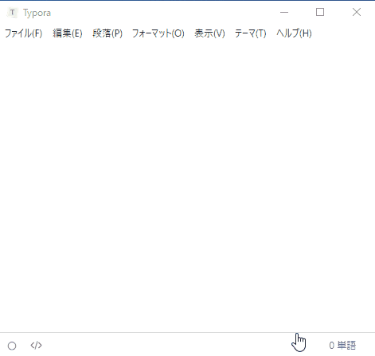
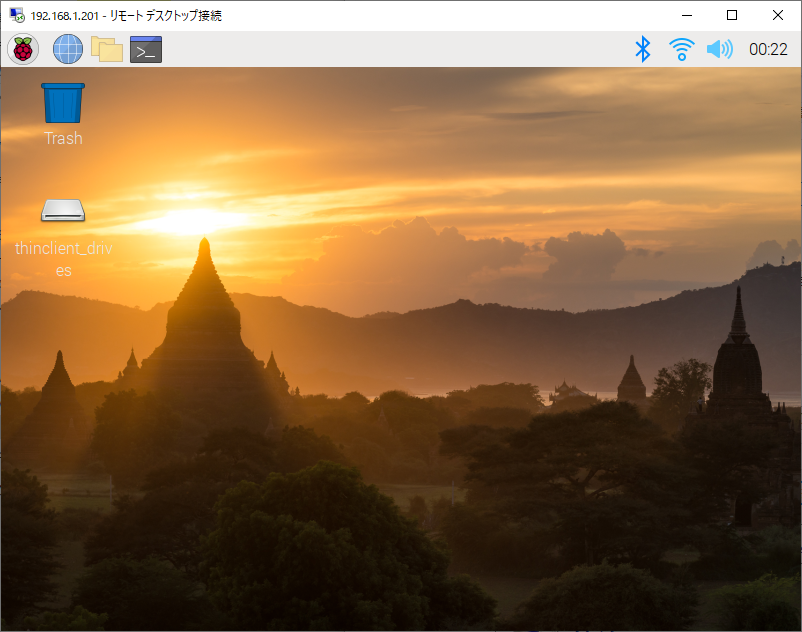

# HTMLファイル作成ツールとしてのTyporaの紹介とMarkdown記法について

このページもTyporaで作っている。

## 何それ？

[Typora — a markdown editor, markdown reader\.](https://typora.io/)

※決してタイピングスピードを競ってはいけない。

## 概要

Markdownエディタ。

* Markdown記法で軽快に書ける。
* 他のエディタと違って、見たままをダイレクトに編集することができる。
* HTMLはもちろん、PDFや他の形式にもエクスポート可能。

Markdownについては次回の記事で少し説明するので、ここでは「ちょっとした記号を覚えるだけでこんな風にHTMLが書けるのかー」ぐらいな感じで見てほしい。

実際はエクスポート機能を使ってMarkdownファイル（.md）をHTMLファイルに変換しているだけ。

ちなみに公式には「Windows、Mac、Linuxにインストール可能」と書いてあるけど、Raspberry Piは対象外。OSというよりアーキテクチャの問題らしい。

参考：[ラズパイにTyporaはインストールできない（Markdownエディタ） \- やってみる](http://ytyaru.hatenablog.com/entry/2019/12/21/111111)

## Markdown記法について

ここでは簡単にMarkdown記法について説明をする。詳しくは自分で調べてみてほしい。実際全部のコマンドを勉強する必要は無くて、使うものだけ覚えたらいい。

### 見出しについて

~~~
# H1相当
## H2相当
### H3相当
~~~

`#`の後に半角スペースを入れて文字を打つと見出しになる。

### コードブロックについて

~~~
​~~~

​~~~
~~~

実際は冒頭のGifアニメにもあるように、`~~~`を打ってエンターを押したらコードブロックになる。

### インラインコードについて

~~~
`inline code`
~~~

``(バッククォート)`でくくるとインラインコードになる。

### リンクについて

~~~
[リンク文字列](asdf.html)
~~~

[リンク文字列](asdf.html)　←　こんな感じになる。

### 画像について

~~~

~~~

画像も、用意さえすれば簡単に貼りつく。

### その他

調べれば便利機能がたくさんある。HTML作成だけじゃなくて普段使いもできる優れもの、それがTypora。