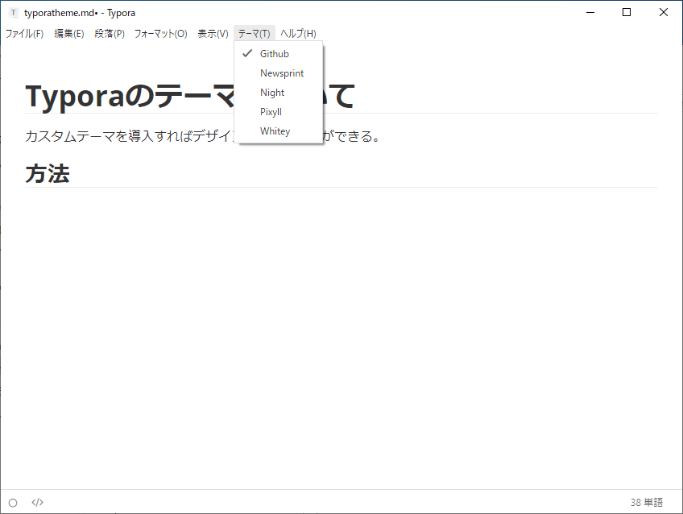
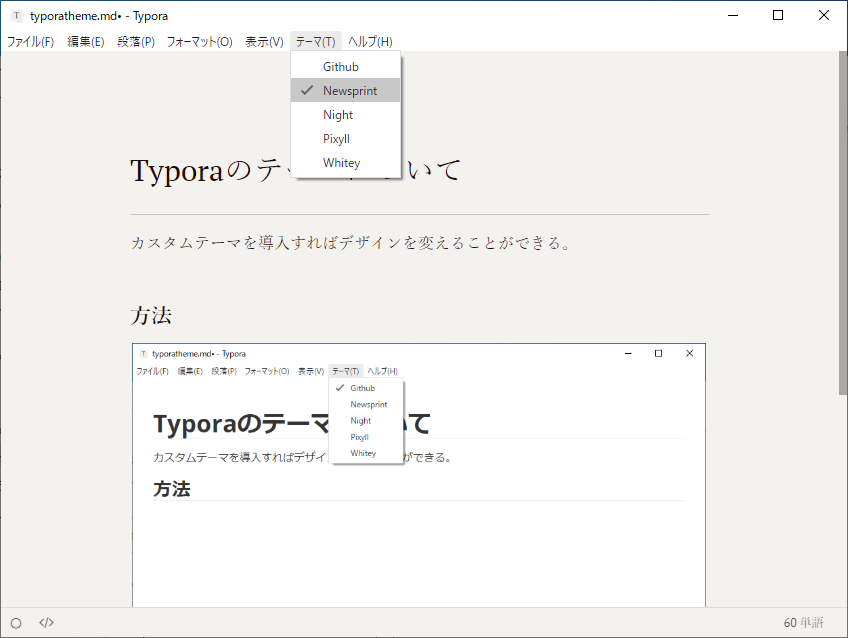
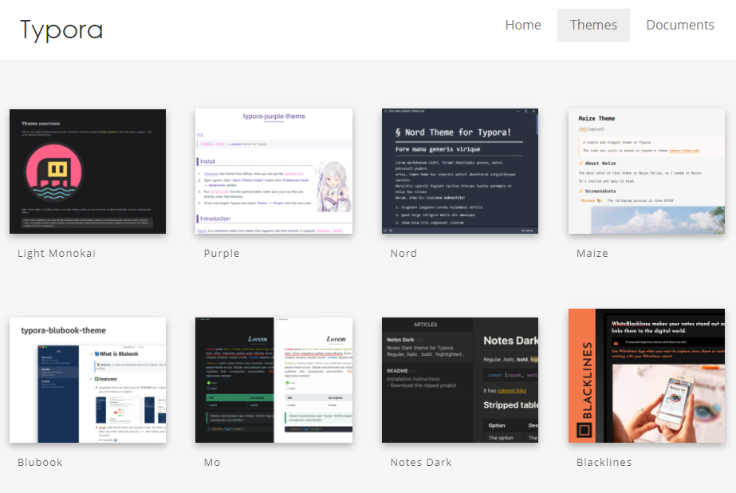

# Typoraのテーマについて

カスタムテーマを導入すればデザインを変えることができる。

## 方法

メニューバーの「テーマ」から適当に選べばよい。

「Newsprint」を選んでみた。

## カスタムテーマのダウンロード

[Themes Gallery — Typora](https://theme.typora.io/)

こんな感じでいろいろ探せるので、とりあえずで選んでみたらどうだろうか。

## テーマの自作

自分はまだそこまで深追いしていないが、探してみると参考になりそうなサイトがあった。

[Typoraのテーマをカスタマイズ！ 3ステップで自分色に染め上げよう \| Output 0\.1](https://pouhon.net/typora-css/4138/)

CSSファイルということらしいので、Typoraとか関係なくCSSの知識を書籍等で勉強すれば自作できる。