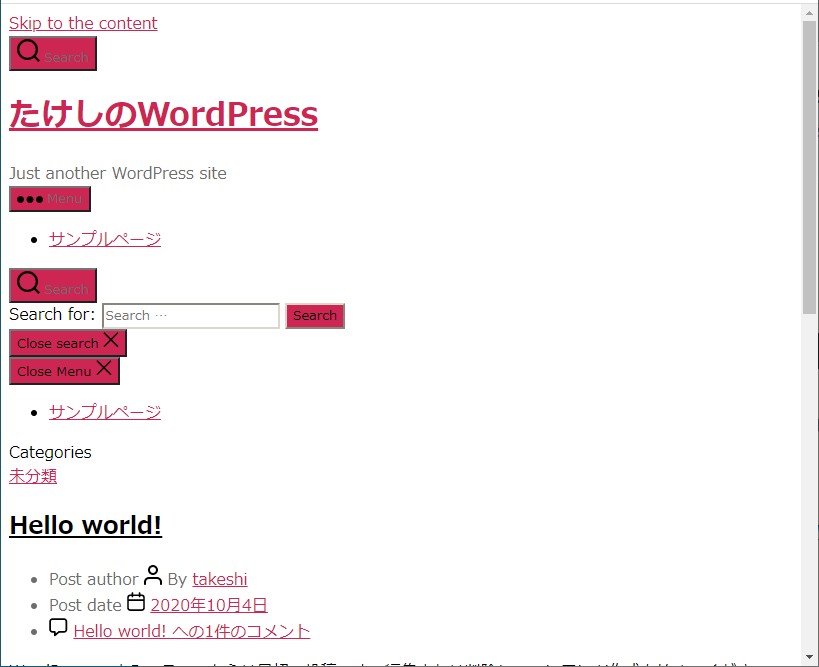

# インストール直後のWordPressの表示がおかしい問題

同一ネットワーク内からアクセスすると

このような表示になるが、外部ネットワークからアクセスするとこうなる。

これの対策を考える。

## 環境

- ローカル（PC側）
  - Windows10
  - PowerShell 5.1
- リモート（Raspberry Pi）
  - Raspberry Pi 3B+
  - Raspberry Pi OS 10.4
  - Nginx 1.14.2
  - PHP 7.3.19-1~deb10u1
  - MariaDB 10.3
  - WordPress 5.5.1-ja

## 原因

Raspberry Piにインストール直後のWordPressのアドレスは、WordPressアドレス・サイトアドレスともに`http://(Raspberry PiのローカルIP)/wordpressblog`となっている。

この状態で外部ネットワークからRaspberry Pi上のWordPressにアクセスすると、ソースのいたるところにローカルIPが表れている。検索をかけたら30か所もあった。

これはつまり表示が崩れるのはcssが正しく読めていないということ。

ただ、問題なのはWordPressアドレスとサイトアドレスを外部向けのURL（このサイトでは`https://arcticstreet.ddns.net/wordpressblog`）に修正すると、今度は家の中からアクセスしたときに表示が崩れる。

## 対策

Raspberry Pi上でWordPressがインストールされたフォルダに行き、`wp-config.php`をテキストエディタで開く。

~~~shell
$ cd ~/www/html/wordpressblog
$ sudo nano wp-config.php
~~~

以下を、このファイルの最終行である`require_once ABSPATH . 'wp-settings.php'`より前に書く。これより前ならどこでもよい。

~~~php
if ($_SERVER['HTTP_HOST'] == '192.168.1.201') {
        define('WP_SITEURL', 'http://192.168.1.201/wordpressblog');
        define('WP_HOME', 'http://192.168.1.201/wordpressblog');
} else {
        define('WP_SITEURL', 'http://arcticstreet.ddns.net/wordpressblog');
        define('WP_HOME', 'http://arcticstreet.ddns.net/wordpressblog');
}
~~~

## 解説

本当にこれでいいのか？

> **注:** HTTP_HOST はリクエストの HTTP HOST ヘッダ値から PHP によって動的に作成されているため[ファイル混入脆弱性](https://en.wikipedia.org/wiki/File_inclusion_vulnerability)が発生する可能性があります。
>
> 参考：[wp\-config\.php の編集 \| WordPress\.org 日本語](https://ja.wordpress.org/support/article/editing-wp-config-php/#wp_siteurl)

ファイルインクルード脆弱性のこと。

> test.phpというファイルがあり、引数にファイルを指定してそのファイル名に拡張子=phpを付加して表示するとする。
> http://example.co.jp/test.php?filename=**welcome**
>
> そこで攻撃者は以下のURLを発行してユーザ名の一覧の取得を試みることが可能となる。
> http://example.co.jp/test.php?filename=**../../../../../../../../../../passwd%00**
>
> %00を付加しているのは、ファイル名をpasswd%00.phpにすることによりphpが無視されpasswd として処理させるため。
> 要するに[ディレクトリトラバーサル](http://security/cyber-attack/directory-traversal.html)の応用である。
>
> [ファイルインクルードの脆弱性とは\(file\-include\-vulnerability\) \| サイバー攻撃大辞典](https://securitychecklist.net/security/cyber-attack/file-include-vulnerability.html)

でも今回の場合`192.168.1.201`か`arcticstreet.ddns.net`の2択で、しかも設定値は2通りともこちらが決めているので、上記のような攻撃は考えにくい。

もし「それでも、ハッカーが何してくるか分からない！こわい！」という人は

* WordPressアドレスとサイトアドレスを外部公開用アドレスにし、WordPressページがどう見えるかを確認するときは常に外部ネットワークからアクセスする
* Raspberry Piの中に（またはローカル（Windows）上に）もう一つWordPressをインストールし、「外部公開用」「同一ネットワーク内アクセス用」としてそれぞれ別々にWordPressアドレスとサイトアドレスを設定し、見た目を変えた場合は2つのWordPressを同期させる

とかしたらどうか。実際今回の解決策を思いつくまではこの2案で検討してた。