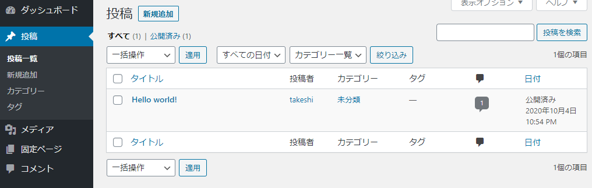
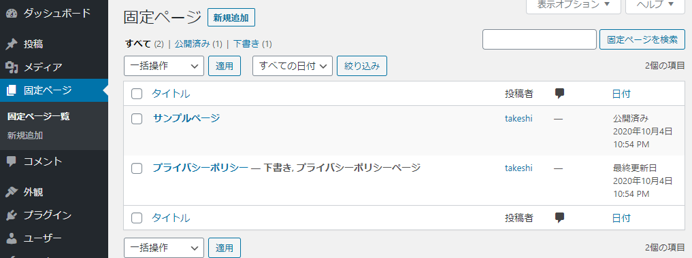

# DBに保存されているWordPress記事の中身を見る

## やりたいこと

MariaDBにログインし、どういう形でWordPressの記事がDB内に保存されているかを見る。

## 環境

- ローカル（PC側）
  - Windows10
  - PowerShell 5.1
- リモート（Raspberry Pi）
  - Raspberry Pi 3B+
  - Raspberry Pi OS 10.4
  - Nginx 1.14.2
  - PHP 7.3.19-1~deb10u1
  - MariaDB 10.3
  - WordPress 5.5.1-ja

## 方法

### MariaDBにログインし、WordPressが使用するDBを開く

リモート上でMariaDBにログインする。

~~~shell
$ sudo mysql
Welcome to the MariaDB monitor.  Commands end with ; or \g.
Your MariaDB connection id is 161
Server version: 10.3.23-MariaDB-0+deb10u1 Raspbian 10

Copyright (c) 2000, 2018, Oracle, MariaDB Corporation Ab and others.

Type 'help;' or '\h' for help. Type '\c' to clear the current input statement.

MariaDB [(none)]>
~~~

MariaDBが管理するDBは複数ある（言い換えると複数のDBを作ってMariaDBで一括管理できる）ので、WordPressが使っているDBを開く。

~~~mysql
MariaDB [(none)]> use wordpress
MariaDB [wordpress]>
~~~

これ以降、打つコマンドはすべてWordPressのDBに対して実行される。

### テーブル一覧の確認

WordPressのDB（以下、DB）内にあるテーブルを確認する。テーブルとはExcelでいう一つのシートみたいなもの。

`show tables;`と打つ。セミコロンを忘れないように。忘れてエンターを押すと、入力がまだ続いていると認識されるので、そういうときは落ち着いてセミコロンだけを打ってエンターを押す。

~~~mysql
MariaDB [wordpress]> show tables;
+-----------------------+
| Tables_in_wordpress   |
+-----------------------+
| wp_commentmeta        |
| wp_comments           |
| wp_links              |
| wp_options            |
| wp_postmeta           |
| wp_posts              |
| wp_term_relationships |
| wp_term_taxonomy      |
| wp_termmeta           |
| wp_terms              |
| wp_usermeta           |
| wp_users              |
+-----------------------+
~~~

色々なテーブルがあるけど、名前からおそらく記事内容は`wp_posts`に保存されているはず。

### `wp_posts`テーブルの中身を確認

`wp_posts`の中身をすべて確認するコマンドは以下。

~~~mysql
MariaDB [wordpress]> select * from wp_posts;
~~~

全部出てくるので、きっととんでもない量になって表示が切れているはず。なので慎重に、まずはどんなカラム（Excelで言う「列」のこと）があるのかを確認する。

`show columns from wp_posts;`を打つ。

~~~mysql
MariaDB [wordpress]> show columns from wp_posts;
+-----------------------+---------------------+------+-----+---------------------+----------------+
| Field                 | Type                | Null | Key | Default             | Extra          |
+-----------------------+---------------------+------+-----+---------------------+----------------+
| ID                    | bigint(20) unsigned | NO   | PRI | NULL                | auto_increment |
| post_author           | bigint(20) unsigned | NO   | MUL | 0                   |                |
| post_date             | datetime            | NO   |     | 0000-00-00 00:00:00 |                |
| post_date_gmt         | datetime            | NO   |     | 0000-00-00 00:00:00 |                |
| post_content          | longtext            | NO   |     | NULL                |                |
| post_title            | text                | NO   |     | NULL                |                |
| post_excerpt          | text                | NO   |     | NULL                |                |
| post_status           | varchar(20)         | NO   |     | publish             |                |
| comment_status        | varchar(20)         | NO   |     | open                |                |
| ping_status           | varchar(20)         | NO   |     | open                |                |
| post_password         | varchar(255)        | NO   |     |                     |                |
| post_name             | varchar(200)        | NO   | MUL |                     |                |
| to_ping               | text                | NO   |     | NULL                |                |
| pinged                | text                | NO   |     | NULL                |                |
| post_modified         | datetime            | NO   |     | 0000-00-00 00:00:00 |                |
| post_modified_gmt     | datetime            | NO   |     | 0000-00-00 00:00:00 |                |
| post_content_filtered | longtext            | NO   |     | NULL                |                |
| post_parent           | bigint(20) unsigned | NO   | MUL | 0                   |                |
| guid                  | varchar(255)        | NO   |     |                     |                |
| menu_order            | int(11)             | NO   |     | 0                   |                |
| post_type             | varchar(20)         | NO   | MUL | post                |                |
| post_mime_type        | varchar(100)        | NO   |     |                     |                |
| comment_count         | bigint(20)          | NO   |     | 0                   |                |
+-----------------------+---------------------+------+-----+---------------------+----------------+
23 rows in set (0.004 sec)
~~~

もっと絞る場合は以下。

~~~mysql
MariaDB [wordpress]> select COLUMN_NAME from INFORMATION_SCHEMA.COLUMNS where TABLE_NAME = 'wp_posts';
+-----------------------+
| COLUMN_NAME           |
+-----------------------+
| ID                    |
| post_author           |
| post_date             |
| post_date_gmt         |
| post_content          |
| post_title            |
| post_excerpt          |
| post_status           |
| comment_status        |
| ping_status           |
| post_password         |
| post_name             |
| to_ping               |
| pinged                |
| post_modified         |
| post_modified_gmt     |
| post_content_filtered |
| post_parent           |
| guid                  |
| menu_order            |
| post_type             |
| post_mime_type        |
| comment_count         |
+-----------------------+
23 rows in set (0.002 sec)
~~~

多いな。

まとめると、`wp_posts`というテーブルはざっくり以下の様になっている。

| ID   | post_author | post_date | post_date_gmt | post_content | post_title | ...  |
| ---- | ----------- | --------- | ------------- | ------------ | ---------- | ---- |
| 1    |             |           |               |              |            |      |
| 2    |             |           |               |              |            |      |

書ききれないので省略しているが、`23 rows in set`とあるので、カラム名は23個、つまり`wp_posts`テーブルには23列ある。それを全部表示させようとするとそりゃ多い。

とりあえず表示が少なそうな`post_title`を表示させてみる。

~~~mysql
MariaDB [wordpress]> select ID, post_title from wp_posts;
+----+--------------------------------+
| ID | post_title                     |
+----+--------------------------------+
|  1 | Hello world!                   |
|  2 | サンプルページ                 |
|  3 | プライバシーポリシー           |
|  4 | 自動下書き                     |
|  5 | The New UMoMA Opens its Doors  |
|  6 | The New UMoMA Opens its Doors  |
|  7 | 会社概要                       |
|  8 | お問い合わせ                   |
|  9 | ブログ                         |
| 10 |                                |
| 11 | The New UMoMA Opens its Doors  |
| 12 | The New UMoMA Opens its Doors  |
| 13 | 会社概要                       |
| 14 | お問い合わせ                   |
| 15 | ブログ                         |
| 16 |                                |
+----+--------------------------------+
16 rows in set (0.001 sec)
~~~

現状ではWordPressインストール時に自動で作成される記事が一つだけしかないので、`ID`が`1`になっているレコード（Excelで言う「行」のこと）が実際のWordPressのトップに表示されているということになる。

また、固定ページとして「サンプルページ」と「プライバシーポリシー（下書き）」があるので、固定ページも1記事として認識されているということになる。

「自動下書き」から下は現時点では不明。

現状分かった`wp_posts`テーブルの内容。

| ID   | post_author | post_date | post_date_gmt | post_content | post_title           | ...  |
| ---- | ----------- | --------- | ------------- | ------------ | -------------------- | ---- |
| 1    |             |           |               |              | Hello world!         |      |
| 2    |             |           |               |              | サンプルページ       |      |
| 3    |             |           |               |              | プライバシーポリシー |      |
| ...  |             |           |               |              | ...                  |      |

次に`post_content`を表示させる。全部のレコードを取得すると量が多そうなので、とりあえず「Hello world!」のみ取得。

~~~mysql
MariaDB [wordpress]> select post_content from wp_posts where ID = 1;
+-------------------------------------------------------------------------------------------------------------------------------------------------------------------------------------------------+
| post_content                                                                                                                                                                                    |
+-------------------------------------------------------------------------------------------------------------------------------------------------------------------------------------------------+
| <!-- wp:paragraph -->

WordPress へようこそ。こちらは最初の投稿です。編集または削除し、コンテンツ作成を始めてください。

<!-- /wp:paragraph -->                                            |
+-------------------------------------------------------------------------------------------------------------------------------------------------------------------------------------------------+
~~~

横に長すぎて表示がヤバい。これはフィールド（Excelで言う「セル」のこと）は基本的に1行表示で、改行も単なる1文字に過ぎないから見た目的に改行されていても内部的には1行と認識される。

他の投稿も見てみる。

~~~mysql
MariaDB [wordpress]> select post_content from wp_posts where ID = 2;
+------------------------------------------------------------------------------------------------------------------------------------------------------------------------------------------------------------------------------------------------------------------------------------------------------------------------------------------------------------------------------------------------------------------------------------------------------------------------------------------------------------------------------------------------------------------------------------------------------------------------------------------------------------------------------------------------------------------------------------------------------------------------------------------------------------------------------------------------------------------------------------------------------------------------------------------------------------------------------------------------------------------------------------------------------------------------------------------------------------------------------------------------------------------------------------------------------------------------------------------------------------------------------------------------------------------------------------------------------------------------------------------------------------------------------------------------------------------------------------------------------------------------------------------------------------------------------------------------------------------------------------------------------------------------------------------------------------------------------------------------------------------------+
| post_content                                                                                                                                                                                                                                                                                                                                                                                                                                                                                                                                                                                                                                                                                                                                                                                                                                                                                                                                                                                                                                                     |
+------------------------------------------------------------------------------------------------------------------------------------------------------------------------------------------------------------------------------------------------------------------------------------------------------------------------------------------------------------------------------------------------------------------------------------------------------------------------------------------------------------------------------------------------------------------------------------------------------------------------------------------------------------------------------------------------------------------------------------------------------------------------------------------------------------------------------------------------------------------------------------------------------------------------------------------------------------------------------------------------------------------------------------------------------------------------------------------------------------------------------------------------------------------------------------------------------------------------------------------------------------------------------------------------------------------------------------------------------------------------------------------------------------------------------------------------------------------------------------------------------------------------------------------------------------------------------------------------------------------------------------------------------------------------------------------------------------------------------------------------------------------------+
| <!-- wp:paragraph -->

これはサンプルページです。同じ位置に固定され、(多くのテーマでは) サイトナビゲーションメニューに含まれる点がブログ投稿とは異なります。まずは、サイト訪問者に対して自分のことを説明する自己紹介ページを作成するのが一般的です。たとえば以下のようなものです。

<!-- /wp:paragraph -->

<!-- wp:quote -->
<blockquote class="wp-block-quote">
はじめまして。昼間はバイク便のメッセンジャーとして働いていますが、俳優志望でもあります。これは僕のサイトです。ロサンゼルスに住み、ジャックという名前のかわいい犬を飼っています。好きなものはピニャコラーダ、そして通り雨に濡れること。
</blockquote>
<!-- /wp:quote -->

<!-- wp:paragraph -->

または、このようなものです。

<!-- /wp:paragraph -->

<!-- wp:quote -->
<blockquote class="wp-block-quote">
XYZ 小道具株式会社は1971年の創立以来、高品質の小道具を皆様にご提供させていただいています。ゴッサム・シティに所在する当社では2,000名以上の社員が働いており、様々な形で地域のコミュニティへ貢献しています。
</blockquote>
<!-- /wp:quote -->

<!-- wp:paragraph -->

新しく WordPress ユーザーになった方は、<a href="http://192.168.1.201/wordpressblog/wp-admin/">ダッシュボード</a>へ行ってこのページ を削除し、独自のコンテンツを含む新しいページを作成してください。それでは、お楽しみください !

<!-- /wp:paragraph --> |
+------------------------------------------------------------------------------------------------------------------------------------------------------------------------------------------------------------------------------------------------------------------------------------------------------------------------------------------------------------------------------------------------------------------------------------------------------------------------------------------------------------------------------------------------------------------------------------------------------------------------------------------------------------------------------------------------------------------------------------------------------------------------------------------------------------------------------------------------------------------------------------------------------------------------------------------------------------------------------------------------------------------------------------------------------------------------------------------------------------------------------------------------------------------------------------------------------------------------------------------------------------------------------------------------------------------------------------------------------------------------------------------------------------------------------------------------------------------------------------------------------------------------------------------------------------------------------------------------------------------------------------------------------------------------------------------------------------------------------------------------------------------------+
1 row in set (0.001 sec)
~~~

さらにヤバい。

### 判明した`wp_posts`テーブルの内容

| ID   | post_author | post_date | post_date_gmt | post_content                                                 | post_title           | ...  |
| ---- | ----------- | --------- | ------------- | ------------------------------------------------------------ | -------------------- | ---- |
| 1    |             |           |               | `<!-- wp:paragraph -->` `
`WordPress へようこそ。...   | Hello world!         |      |
| 2    |             |           |               | `<!-- wp:paragraph -->` 
これはサンプルページです。... | サンプルページ       |      |
| 3    |             |           |               |                                                              | プライバシーポリシー |      |
| ...  |             |           |               |                                                              | ...                  |      |

こういう形でDB内に保存されている。WordPressはここから必要な記事の内容だけを引っ張り出してきて表示している。

気になる人は打ち込んだコマンドを色々変えてやってみよう。

## 解説

### SQL文

今回の記事の中で`select`から始まるコマンドを「SQL文」という。詳しい解説は別の記事でするが、仕組みとしてはDBに対してSQL文を発行し、それに基づいてDBはテーブルを作成し返却する。なので、SQL文を打って返ってくるのは常にテーブル。多分。