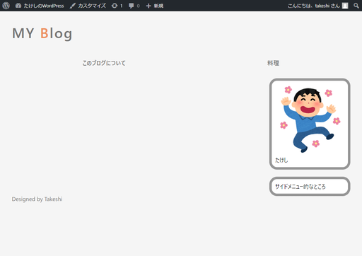
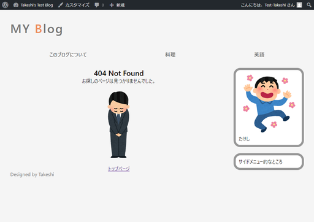

# 404ページを作る

現状では適当に`http://(WordPressのURL)/asdf`とか打って存在しない記事にアクセスしようとすると、

これはひどい。

## 環境

- ローカル（PC側）
  - Windows10
  - PowerShell 5.1
- リモート（Raspberry Pi）
  - Raspberry Pi 3B+
  - Raspberry Pi OS 10.4
  - Nginx 1.14.2
  - PHP 7.3.19-1~deb10u1
  - WordPress 5.5.3-ja

## 手順

`404.php`という名前でファイルを新規作成し、`index.php`の内容を丸ごとコピペ。

`404.php`

~~~php+HTML
<?php get_header(); ?>

    <main>
        

            

                <?php get_template_part('articles'); ?>
            

            

                <?php get_sidebar(); ?>
            

        

    </main>

<?php get_footer(); ?>
~~~

そして、`<?php get_template_part('articles'); ?>`の部分を削除し、ページが見つからない旨のメッセージを書けば良い。

`404.php`（変更後）

~~~php+HTML
<?php get_header(); ?>

    <main>
        

            <!-- ----------ここから---------- -->
            

                <h2>404 Not Found</h2>
                
お探しのページは見つかりませんでした。

                /image/rs-pose_syazai_man.png" alt="404">
                <a href="<?php echo esc_url( home_url() ); ?>">トップページ</a>
            

            <!-- ----------ここまで---------- -->
            

                <?php get_sidebar(); ?>
            

        

    </main>

<?php get_footer(); ?>
~~~

`div`タグに`noarticles`クラスを付与し、再スタイリングした。

使用画像。

こんな感じ。

まあいいんじゃないか。

## 参考

[404エラーページの作成 \- WordPress Codex 日本語版](https://wpdocs.osdn.jp/404%E3%82%A8%E3%83%A9%E3%83%BC%E3%83%9A%E3%83%BC%E3%82%B8%E3%81%AE%E4%BD%9C%E6%88%90)