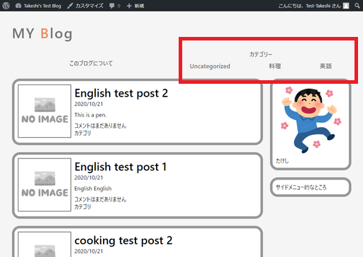

# カテゴリー一覧ページを作る

カテゴリーごとに分類された記事のみ表示するようなページ。

## 環境

- ローカル（PC側）
  - Windows10
  - PowerShell 5.1
- リモート（Raspberry Pi）
  - Raspberry Pi 3B+
  - Raspberry Pi OS 10.4
  - Nginx 1.14.2
  - PHP 7.3.19-1~deb10u1
  - WordPress 5.5.3-ja

## 準備1

そもそもカテゴリー分けするほど記事を書いていないので、カテゴリーを作り適当に記事を書く。

料理カテゴリ。

トンテキ。

ぶり大根。

## 気付いた不備

* `index.php`に表示される記事の日付が変わっていない
* 個別記事ページに日付が無い
* コメント記入欄が無い（個別記事テンプレートを作るときに必要だった）
* カテゴリー「料理」へのリンクがどこにもない
* 記事のカテゴリー表示が全くない

## 作業概要

* カテゴリー一覧テンプレートを`index.php`から流用する
* 各カテゴリーへのリンクを張る

記事日付と所属カテゴリー表示、コメント欄作成は別記事にまとめる。

## 準備2

テスト環境にも適当にカテゴリー記事を追加。

## 手順

### カテゴリー一覧テンプレートを`index.php`から流用する

カテゴリーページは`category.php`という名前で保存すればいいらしい。

`category.php`（中身は`index.php`の丸写し）

~~~php+HTML
<?php get_header(); ?>

    <main>
        

            

                <?php if ( have_posts() ) : while ( have_posts() ) : the_post(); ?>
                    

                        

                            

                                

                                    <?php
                                        if ( has_post_thumbnail()) {
                                            the_post_thumbnail( 'thumbnail' );
                                        } else {
                                            echo '';
                                        }
                                    ?>
                                

                                <section>
                                    

                                        <a href="<?php echo the_permalink( $post ); ?>"><h1><?php the_title(); ?></h1></a>
                                        
<time>2020/10/21</time>

                                    

                                    

                                        <?php the_content(); ?>
                                    

                                    

                                        
<?php comments_number(); ?>

                                        
カテゴリ

                                    

                                </section>
                            

                        

                    

                <?php endwhile; endif; ?>
            

            

                <?php get_sidebar(); ?>
            

        

    </main>

<?php get_footer(); ?>
~~~

ただ、全く一緒だとよく分からないので、「料理カテゴリー　記事一覧」みたいな文字列は表示したい。

現在のカテゴリー名を表示するWordPress関数は

~~~php
single_cat_title();
~~~

だそうだ。

このようにして使う。

~~~php+HTML

<?php single_cat_title(); ?>カテゴリー　記事一覧

~~~

これをループの外に書く。ついでに`div`タグで囲んでおく。

~~~PHP+HTML
<?php get_header(); ?>

    <main>
        

            

                <!-- ――――――――――ここから―――――――――― -->
                

                    
<?php single_cat_title(); ?>カテゴリー　記事一覧

                

                <!-- ――――――――――ここまで―――――――――― -->
                <?php if ( have_posts() ) : while ( have_posts() ) : the_post(); ?>
                    

                        ～略～
~~~

とりあえず表示させてみる。`http://(WordPressのURL)/category/cooking`でアクセスできる。

まあ、装飾何にもしてないからな。ということでちょっと見やすくする。

`mystyle.css`に追記。

~~~css
/* カテゴリーページ用 */
.category_title {
    font-size: 30px;
    font-weight: bold;
    margin: 20px 0;
}
~~~

まあこんなもんか。

### 各カテゴリーへのリンクを張る

`wp_list_categories()`で、リンク付きのカテゴリーが出力できるらしい。`header.php`の、カテゴリーリンクの予定にしていたところにPHPコードを貼り付ける。

`header.php`

~~~php+HTML
<header>
    

        

            <a href="<?php echo esc_url( home_url() ); ?>" alt="Blog Link">MY Blog</a>
        

        

            <nav>
                <ul>
                    <li><a href="<?php echo esc_url( get_page_link( 22 ) ); ?>">このブログについて</a></li>
                    <?php wp_list_categories(); ?> <!-- ←ここ -->
                </ul>
            </nav>
        

    

</header>
~~~

ありゃ、なんか違う。

これの解決は`wp_list_categories('title_li=')`という感じで引数`title_li`に何も渡さなければいいらしい。

修正したのがこちら。いい感じ。

`wp_list_categories('title_li=&exclude=1')`としてやればUncategorizedだけ非表示にできる。

文字列を表示するだけではなく、ちゃんとリンクになっているところが良い。

Raspberry Piにアップロードして確認。

英語カテゴリーへのリンクが表示されていないけど、記事が一つも無いから表示しないっぽい。賢い。

## 参考

[テンプレートタグ/single cat title \- WordPress Codex 日本語版](http://wpdocs.osdn.jp/%E3%83%86%E3%83%B3%E3%83%97%E3%83%AC%E3%83%BC%E3%83%88%E3%82%BF%E3%82%B0/single_cat_title)
[テンプレートタグ/wp list categories \- WordPress Codex 日本語版](http://wpdocs.osdn.jp/%E3%83%86%E3%83%B3%E3%83%97%E3%83%AC%E3%83%BC%E3%83%88%E3%82%BF%E3%82%B0/wp_list_categories)