# （任意）コードのハイライトを設定する

ハイライトとは↓こんなの

~~~html
<html>
<head>
	<title>takeshi</title>
</head>
<body>
	
takeshi is takeshi

</body>
</html>
~~~

言語に応じてキーワードに色が付いたり、そもそもコード部分は書式がちょっと違ったりすること。これが無いとコードが非常に見にくい。

例えば「料理でオブジェクト指向を考える」という訳の分からない記事を書いてみた時に、

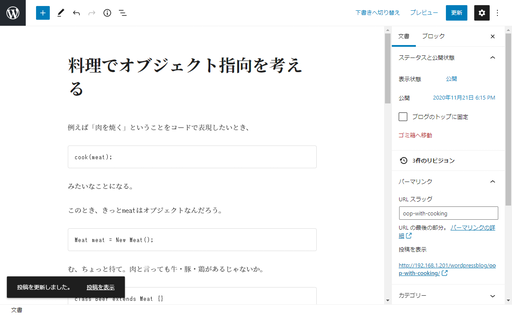

コードとして書いた部分の書式が全く変わらないからとても読みにくい。

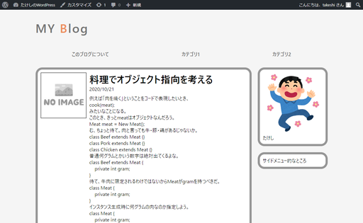

これを何とかする。

## 環境

- ローカル（PC側）
  - Windows10
  - PowerShell 5.1
- リモート（Raspberry Pi）
  - Raspberry Pi 3B+
  - Raspberry Pi OS 10.4
  - Nginx 1.14.2
  - PHP 7.3.19-1~deb10u1
  - WordPress 5.5.3-ja

## 概要

[highlight\.js](https://highlightjs.org/)というものが便利らしい。

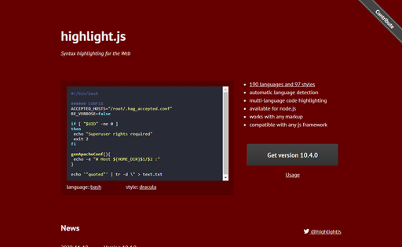

1. 上記サイトからファイルをダウンロードする
2. ダウンロードしたファイルから必要なものだけを必要な場所に配置
3. `header.php`を書き換える

## 準備

テスト環境にもテスト用に適当な記事を書く。

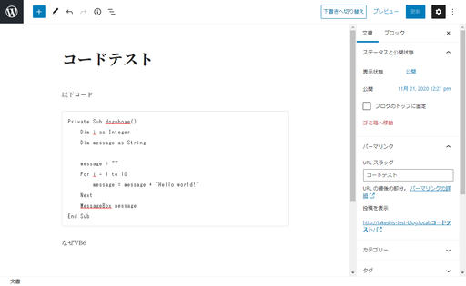

同じように見にくい。

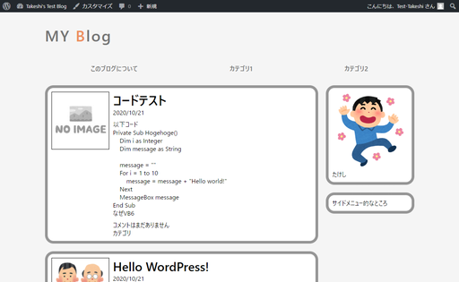

## 手順

### highlight\.jsからファイルをダウンロード

[Getting highlight\.js](https://highlightjs.org/download/)

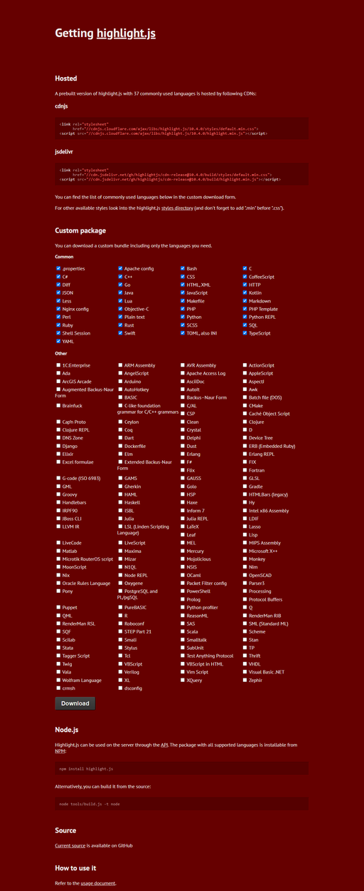

好きな言語をチェックしてDownloadボタンをクリック。基本的には何も変える必要は無い。

### ダウンロードしたファイルから必要なものだけを必要な場所に配置

ダウンロードしたzipファイルを展開すると以下のようになっているので、`highlight.pack.js`と

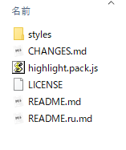

`styles`フォルダの中のどれか適当な`.css`ファイルを選ぶ。

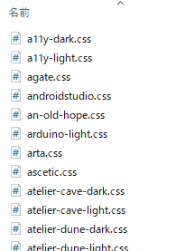

どれを選んだらいいのかというと、[highlight\.js demo](https://highlightjs.org/static/demo/)にデモが表示されているので、それで確認して選ぶ。選び方は「Themes」というところを適当にクリック。（以下の画像では「A 11 Y Dark」を選択。目に優しそう。）

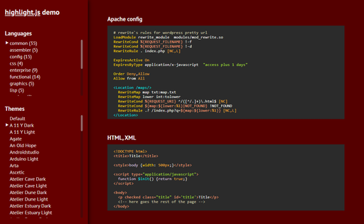

ということで、`highlight.pack.js`と`a11y-dark.css`を、自作テーマフォルダ`wp-content/themes/takeshi-test`にぶち込む。

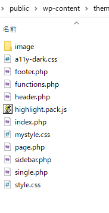

### `header.php`を書き換える

`header.php`内の`head`タグ内。

~~~HTML
<!DOCTYPE html>
<html lang="ja">
<head>
    <meta charset="utf-8">
    <title>たけしのWordPress</title>
    <link rel="stylesheet" href="<?php echo get_template_directory_uri(); ?>/mystyle.css">
    <?php wp_head(); ?>
</head>
~~~

この`<link rel="stylesheet" ...`の下に、今入れた`.css`ファイルと`.js`ファイルを`mystyle.css`の指定と同じようにする。ただし、`.js`ファイルの指定は`link`タグではなく`script`タグ。

書き換え後。

~~~HTML
<!DOCTYPE html>
<html lang="ja">
<head>
    <meta charset="utf-8">
    <title>たけしのWordPress</title>
    <link rel="stylesheet" href="<?php echo get_template_directory_uri(); ?>/mystyle.css">
    <link rel="stylesheet" href="<?php echo get_template_directory_uri(); ?>/a11y-dark.css">
    
    <?php wp_head(); ?>
</head>
~~~

さらに以下の一行を`.js`ファイル指定の直後に入れる。

~~~HTML

~~~

`header.php`を保存してブログを再読み込み。

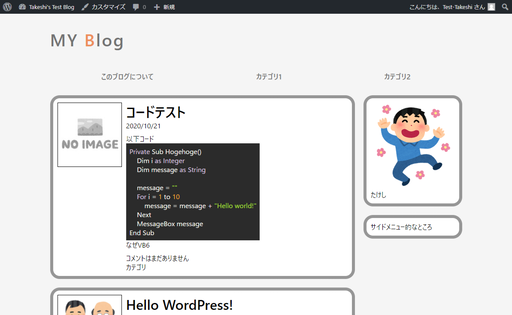

おお、反映されたけど違和感しかない。

`a11y-dark.css`の代わりに、もうちょっとサイトの雰囲気に合わせた別のやつを選べば上手くいきそうだけど面倒なのでまた今度。

本番環境にアップ。

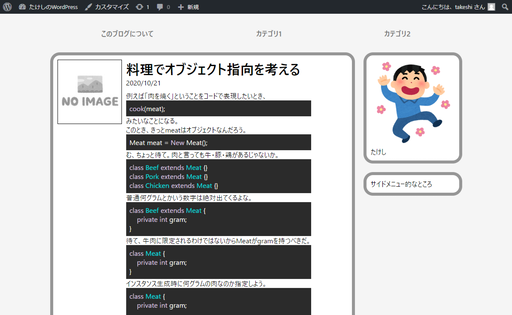

うーん、見にくい。そしてインラインのコードタグが変化していない。

ちょっとCSSに手を加える。

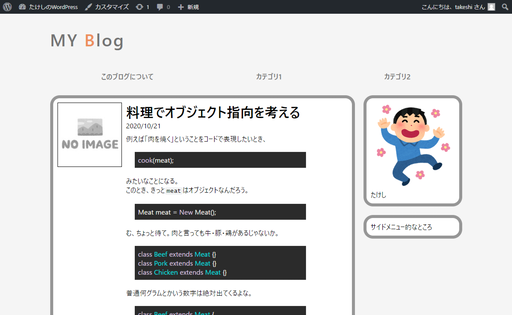

`pre`タグに`margin`を設定し、クラス属性が付与されていない`code`タグに、[Typora](../webserver/typora.html)がいつも付けてくれるスタイリングをマネして付けた。

`mystyle.css`の追記

~~~css
/* リセットCSSの直後に */

:root{
    --monospace:"Lucida Console",Consolas,"Courier",monospace;
}

/* どこか適当な場所に */

pre {
    margin: 20px;
}

code:not(.hljs) {
    text-align: left;
    vertical-align: initial;
    font-size: 0.9em;
    border-radius: 3px;
    border: 1px solid #e7eaed;
    background-color: #f3f4f4;
    padding: 0 2px;
    font-family: var(--monospace);
}
~~~

