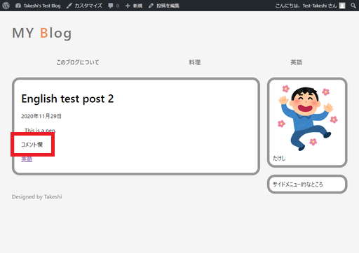
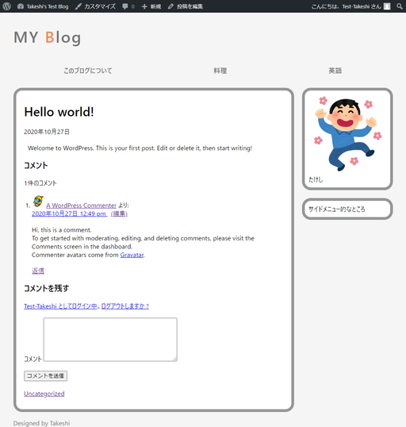
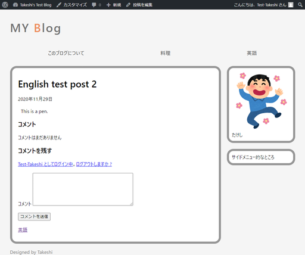

# 記事単独ページにコメント欄を作る

コメントを投稿できるようにする。

## 環境

- ローカル（PC側）
  - Windows10
  - PowerShell 5.1
- リモート（Raspberry Pi）
  - Raspberry Pi 3B+
  - Raspberry Pi OS 10.4
  - Nginx 1.14.2
  - PHP 7.3.19-1~deb10u1
  - WordPress 5.5.3-ja

## 手順

### コメント欄テンプレートを作成しインクルード

`comments.php`という名前で新たにファイルを作る。とりあえず確認用ということで適当に文字を書いておく。

`comments.php`

~~~php+HTML

コメント欄

~~~

これを`article.php`がインクルードするようにする。

`article.php`

~~~php+HTML
<section>
    

        <h1><?php the_title(); ?></h1>
        
<time><?php echo get_the_date(); ?></time>

    

    

        <?php the_content(); ?>
    

    

        <?php comments_template(); ?> <!-- ←ここ -->
    

    

        
<?php the_category(); ?>

    

</section>
~~~

確認。一応インクルードできている。

### `comments.php`の中身を書く

`comments.php`の内容を消して、

* コメント数
* コメント
* コメント入力フォーム

を作る。

`comments.php`

~~~php+HTML
<h3>コメント</h3>

<?php comments_number(); ?>

<ol>
    <?php wp_list_comments( array( 'style' => 'ol' ) ); ?>
</ol>
<?php comment_form(); ?>
~~~

`mystyle.css`（どこか適当な場所に追記）

~~~css
/* コメント */
.article_comments h3{
    font-size: 1.3em;
    font-weight: bold;
}

.article_comments ol{
    list-style-type: decimal;
    margin-left: 20px;
}

.comment-respond {
    margin-top: 20px;
}
~~~

WordPressをインストールしたときに最初からあった記事にはコメントも入っていたからそれを使って確認。雑な感じがすごいけど、一応表示された。

コメントが無いときはこう。

## 解説

### コメント数の表示

[以前の記事](customtheme3.html)で`index.php`に埋め込んだ（今では`articles.php`に分割された）`<?php comments_number(); ?>`で表示できる。

### コメントの表示

`wp_list_comments()`で勝手にリスト表示してくれる。ただし、`li`タグで並べるだけで、外側の`ol`タグ（番号付き箇条書き）や`ul`タグ（番号無し箇条書き）は自分で書かないといけないらしい。そして`ol`タグを使う時は`wp_list_comments()`に引数を渡してあげないといけない。

結果、こうなる。

~~~php+HTML
<ol>
    <?php wp_list_comments( array( 'style' => 'ol' ) ); ?>
</ol>
~~~

参考：[テンプレートタグ/wp list comments \- WordPress Codex 日本語版](https://wpdocs.osdn.jp/%E3%83%86%E3%83%B3%E3%83%97%E3%83%AC%E3%83%BC%E3%83%88%E3%82%BF%E3%82%B0/wp_list_comments)

### コメント入力フォームの表示

`comment_form()`で一発表示。特にこだわらなければ特に引数をいじる必要もない。

参考：[関数リファレンス/comment form \- WordPress Codex 日本語版](https://wpdocs.osdn.jp/%E9%96%A2%E6%95%B0%E3%83%AA%E3%83%95%E3%82%A1%E3%83%AC%E3%83%B3%E3%82%B9/comment_form)

### もっと細かくカスタマイズしたい場合

そこまでする気力が無いので、やりたい人は以下を参考にどうぞ。

[WordPressテーマの作り方 » コメントフォームを設置する](http://wordpress.hitsuji.me/comments-form/)