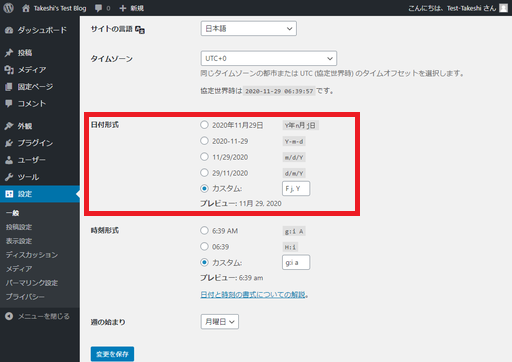
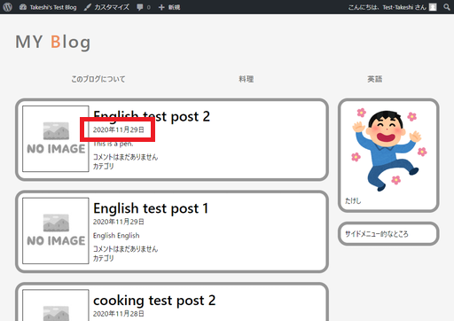
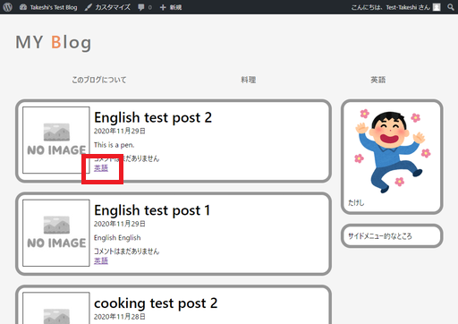

# 記事に「投稿日付」と「所属カテゴリタグ」を付ける

記事ループのリファクタリングを終えたところで、記事ループ内の調整をしていく。

## 環境

- ローカル（PC側）
  - Windows10
  - PowerShell 5.1
- リモート（Raspberry Pi）
  - Raspberry Pi 3B+
  - Raspberry Pi OS 10.4
  - Nginx 1.14.2
  - PHP 7.3.19-1~deb10u1
  - WordPress 5.5.3-ja

## 投稿日付

`echo get_the_date();`で取得できるらしい。

`articles.php`

~~~php+HTML
～略～
<section>
    

        <a href="<?php echo the_permalink( $post ); ?>"><h1><?php the_title(); ?></h1></a>
        
<time><?php echo get_the_date(); ?></time>
 <!-- ←ここ -->
    

    

        <?php the_content(); ?>
    

    

        
<?php comments_number(); ?>

        
カテゴリ

    

</section>
～略～
~~~

`article.php`

~~~php+HTML
～略～
<section>
    

        <h1><?php the_title(); ?></h1>
        
<time><?php echo get_the_date(); ?></time>
 <!-- ←ここ -->
    

    

        <?php the_content(); ?>
    

    

    

</section>
～略～
~~~

日付表示のフォーマットをWordPressの管理画面から選ぶ。

良い。

## 記事の所属カテゴリー

`the_category()`で表示されるらしい。

`articles.php`

~~~php+HTML
<section>
    

        <a href="<?php echo the_permalink( $post ); ?>"><h1><?php the_title(); ?></h1></a>
        
<time><?php echo get_the_date(); ?></time>

    

    

        <?php the_content(); ?>
    

    

        
<?php comments_number(); ?>

        
<?php the_category(); ?>
 <!-- ←ここ -->
    

</section>
~~~

`article.php`

~~~php+HTML
<section>
    

        <h1><?php the_title(); ?></h1>
        
<time><?php echo get_the_date(); ?></time>

    

    

        <?php the_content(); ?>
    

    

        
<?php the_category(); ?>
 <!-- ←ここ -->
    

</section>
~~~

リンクの色が気に入らないけど、まあこんなもんか。

## 参考

[テンプレートタグ/get the date \- WordPress Codex 日本語版](https://wpdocs.osdn.jp/%E3%83%86%E3%83%B3%E3%83%97%E3%83%AC%E3%83%BC%E3%83%88%E3%82%BF%E3%82%B0/get_the_date)
[テンプレートタグ/the category \- WordPress Codex 日本語版](https://wpdocs.osdn.jp/%E3%83%86%E3%83%B3%E3%83%97%E3%83%AC%E3%83%BC%E3%83%88%E3%82%BF%E3%82%B0/the_category)