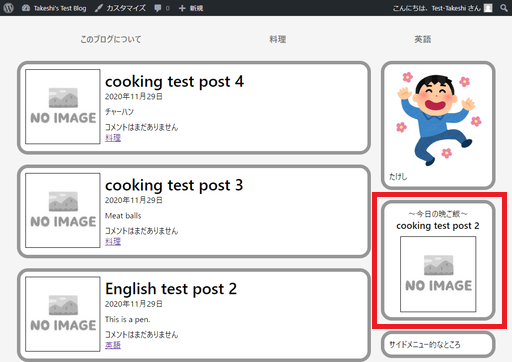
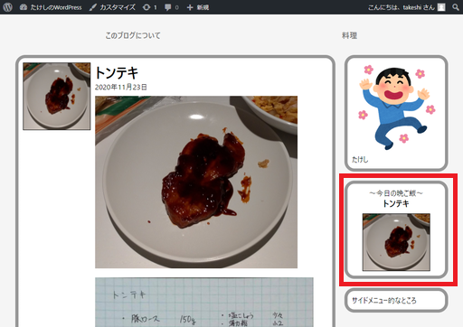

# WordPressに独自機能を持たせる

ここでは「料理カテゴリーの記事の中からランダムに選んで『今日の晩ごはんはこれ』をトップページに表示する」ということを目指す。

## 環境

- ローカル（PC側）
  - Windows10
  - PowerShell 5.1
- リモート（Raspberry Pi）
  - Raspberry Pi 3B+
  - Raspberry Pi OS 10.4
  - Nginx 1.14.2
  - PHP 7.3.19-1~deb10u1
  - WordPress 5.5.3-ja

## 手順

### `functions.php`に自作関数を定義する

がっつりPHPのコードを書いていかないといけないかなと思ったら、`WP_Query`というやつの存在で結構簡単に書けた。

`functions.php`に以下を追記。

~~~php
function get_dinner() {

    // 1
    $the_query = new WP_Query( array(
        'orderby' => 'rand',
        'posts_per_page' => '1',
        'category_name' => 'cooking',
        ) );

    // 2
    if ( $the_query->have_posts() ) :
        while ( $the_query->have_posts() ) :
            $the_query->the_post();

    		// 3
            echo "<a href=" . get_permalink() . "><h1>" . the_title('','',FALSE) . "</h1></a>";
            if ( has_post_thumbnail()) {
                the_post_thumbnail( 'thumbnail' );
            } else {
                echo '';
            }
            
        endwhile;
    endif;
}
~~~

部分ごとに解説する

1. ここの`WP_Query`というのが[関数リファレンス/WP Query \- WordPress Codex 日本語版](https://wpdocs.osdn.jp/%E9%96%A2%E6%95%B0%E3%83%AA%E3%83%95%E3%82%A1%E3%83%AC%E3%83%B3%E3%82%B9/WP_Query)を見てもさっぱりよく分からなかったけど、どうも引数`array`に入っているパラメーターを元に記事を呼び出しているらしい。`'orderby' => 'rand'`でランダムに取得。`'category_name' => 'cooking'`で、料理カテゴリーから記事を取ってくる、ということになるらしい。
2. ここは記事ループ部分。ただし、1で定義した`$the_query`のメソッドを使う形になるらしい。ただ、`$the_query->the_post()`を書いてしまえばあとはいつも通りの書き方でいい。
3. ここは今までやったことのコピペでなんとかする。PHPでは`.`は文字列と文字列を接続する演算子で、`the_title('','',FALSE)`で引数に色々入れているのは、`the_title()`は第3引数に`FALSE`を入れてあげないと、HTML用の出力をしてしまうらしい。正確な言い方はよく分からないけど、大体そんな感じ。他のテンプレートとは違ってこの`functions.php`はPHPのコードを書いていくから、純粋に文字列を返してもらって`.`でつなげるということをする。

### サイドバーに晩ご飯欄を追加

トップページ限定で晩ご飯欄を表示させることにした。

`sidebar.php`に以下を追記。

~~~php+HTML

    

        

            /image/rs-pose_dance_ukareru_man.png" alt="Profile image">
            
たけし

        

    

<!-- ----------ここから---------- -->
<?php if (is_home()) : ?>
    

        

            

                

                    
～今日の晩ご飯～

                    <?php get_dinner(); ?>
                

            

        

    

<?php endif; ?>
<!-- ----------ここまで---------- -->

    

        

            
サイドメニュー的なところ

        

    

~~~

`mystyle.css`に以下を追記。

~~~css
.dinner {
    display: flex;
    flex-direction: column;
    justify-content: center;
    align-items: center;
}

.dinner h1{
    font-size: 1.2em;
}

.dinner a{
    text-decoration: none;
    color: black;
}

.dinner img{
    border: black solid 1px;
    margin-top: 10px;
}
~~~

確認。まあ目的は達成しているのではないか。

Raspberry Piにもアップして確認。「あっ、今日トンテキにしよ」ってなる。多分。

## 参考

[【WordPress】初心者でもできる！　超簡単な『ユーザー定義関数』を設定してWordPressをもっと便利に使いこなす方法 \- 株式会社オンズ](https://on-ze.com/archives/441)
[WordPressで記事をランダムに表示させる方法！カテゴリ毎でも可 \| HPcode](https://haniwaman.com/wordpress-archive-random/)
[関数リファレンス/WP Query \- WordPress Codex 日本語版](https://wpdocs.osdn.jp/%E9%96%A2%E6%95%B0%E3%83%AA%E3%83%95%E3%82%A1%E3%83%AC%E3%83%B3%E3%82%B9/WP_Query)