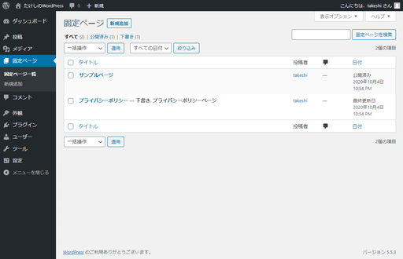
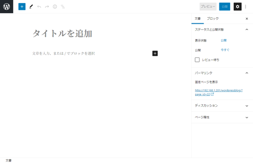
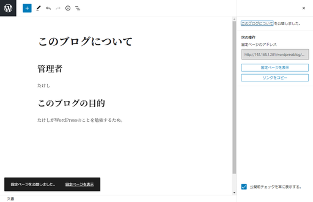
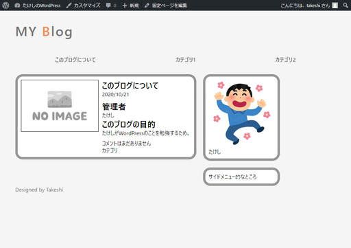
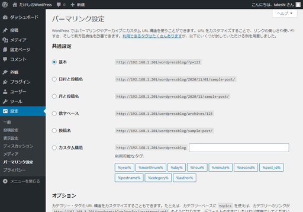
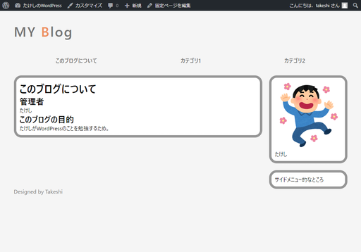
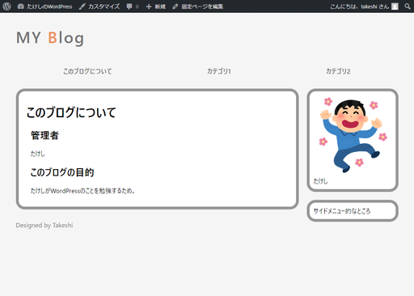

# 固定ページを作る

「固定ページ」とは記事とは独立した内容のページのことで、特に個人ブログとしては自己紹介やブログのコンセプトなど、頻繁には更新しないような内容を載せるページのこと。

`index.php`の内容がほぼそのまま使えてお手軽だということで、`index.php`を作った後は固定ページを作りましょうと紹介しているサイトが多い印象。

## 環境

- ローカル（PC側）
  - Windows10
  - PowerShell 5.1
- リモート（Raspberry Pi）
  - Raspberry Pi 3B+
  - Raspberry Pi OS 10.4
  - Nginx 1.14.2
  - PHP 7.3.19-1~deb10u1
  - WordPress 5.5.3-ja

## 方法

### まずはWordPress管理画面上で固定ページを作成する

管理画面の左のメニューから「固定ページ」を選択すれば、新規追加ボタンとデフォルトで作成されている固定ページが表示される。

よく分からないのでとりあえずデフォルトをものを消して、新規追加をする。

適当に書いて適当に公開する。本当に適当なので公開してもいいのかどうか悩むレベル。

「固定ページを表示」をクリックすると以下のように表示される。

固定ページ表示用のテンプレートをまだ用意していないので、代わりに`index.php`が使用されている。

固定ページのURLは`(WordPressのURL)/?page_id=22`となっている。これはWordPressの設定をいじればパーマリンクという項目が現れ、固定ページ編集画面上で変更することが可能。

ただ現時点では設定を変更するとエラーが出る様子。この記事を書く前にWordPressのバージョンを5.5.3に変えたからかもしれない。そしてこのエラーと闘うには一筋縄ではいかない様子。

現在の設定は「基本」。

ちなみにこれまでの作業は全部リモート上の本番ブログでやってしまったので、ローカルのテストブログでも同じことをしておく。ちなみにローカルではパーマリンクの問題は起きなかった。

※[対処法を別記事にまとめた。](permalink.html)

### 作業方針

1. 固定ページ用のテンプレート`page.php`の作成。
2. 固定ページへのリンクを作成。

また、作ってみて分かった問題点もついでに解消しておく。

3. ページの右余白がなぜか大きい。
4. 記事タイトルと内容の中の見出しの区別が付きにくい。

### 固定ページ用のテンプレートを作成

さっき表示されたのは`index.php`をテンプレートとしたページで、ただ表示するだけならそのままでよい。ただ、記事ではないので以下を除くことにする。

* サムネイル
* 日付
* コメント
* カテゴリ

`page.html`

~~~php+HTML
<?php get_header(); ?>

    <main>
        

            

                <?php if ( have_posts() ) : while ( have_posts() ) : the_post(); ?>
                    

                        

                            

                                <section>
                                    

                                        <h1><?php the_title(); ?></h1>
                                    

                                    

                                        <?php the_content(); ?>
                                    

                                    

                                    

                                </section>
                            

                        

                    

                <?php endwhile; endif; ?>
            

            

                <?php get_sidebar(); ?>
            

        

    </main>

<?php get_footer(); ?>
~~~

### 固定ページへのリンクを作成（ID指定）

ID指定でURLを作るのは不本意だが、今は仕方なしということで。

`get_page_link( $id )`で指定IDの記事のURLが出力されるらしい。上で見たように、固定ページのIDは`22`となっている。また、`esc_url()`でURLエスケープ処理をしておいた方がいいらしいので、以下の形になる。

~~~php+HTML
<?php echo esc_url( get_page_link( 22 ) ); ?>
~~~

これを`header.php`の「このブログについて」のリンクのURLとして埋め込む。

`header.php`

~~~php+HTML
<nav>
    <ul>
        <li><a href="<?php echo esc_url( get_page_link( 22 ) ); ?>">このブログについて</a></li>
        <li><a href="index.html">カテゴリ1</a></li>
        <li><a href="index.html">カテゴリ2</a></li>
    </ul>
</nav>
~~~

ついでに気付いたのでブログタイトルをクリックしたときのリンクも修正しておく。こっちは`home_url()`でいいらしい。

`header.php`

~~~php+HTML

    <a href="<?php echo esc_url( home_url() ); ?>" alt="Blog Link">MY Blog</a>

~~~

### ページの右余白が大きくなるのを修正

CSSの中で`main > wrapper > cotainer`要素の`width`が指定されていないものによるもの。これは`articles`クラス も付与しているので、それに`width`要素を追加する。

`mystyle.css`

~~~css
.artciles {
    width: 100%;
}
~~~

### 記事タイトルと内容の中の見出しの区別が付きにくいのを修正

調べてみると`h1`タグと`h2`タグの`font-size`が同じに指定されている。これはブラウザが勝手に指定してるっぽい。

別にWebデザイナーを目指してやっているわけではないので、全ブラウザの対応を考えてCSSを作成するのは避けたいところ。でも場当たり的に`h1`タグの`font-size`を大きくしたときに、他のブラウザだと不自然に大きくなりすぎるかもしれないのも避けたい。

面倒だけどリセットCSSを書いて、デフォルトのスタイルを一旦全部打ち消すことにする。コピペ元は有名らしい[Eric Meyer’s “Reset CSS” 2\.0 \| CSS Reset](https://cssreset.com/scripts/eric-meyer-reset-css/)から取得。

`mystyle.css`

~~~css
* {
    padding:0;
    margin:0;
    box-sizing: border-box;
}

↓↓↓↓ (以下に書き換え) ↓↓↓↓

/* http://meyerweb.com/eric/tools/css/reset/ 
   v2.0 | 20110126
   License: none (public domain)
*/

html, body, div, span, applet, object, iframe,
h1, h2, h3, h4, h5, h6, p, blockquote, pre,
a, abbr, acronym, address, big, cite, code,
del, dfn, em, img, ins, kbd, q, s, samp,
small, strike, strong, sub, sup, tt, var,
b, u, i, center,
dl, dt, dd, ol, ul, li,
fieldset, form, label, legend,
table, caption, tbody, tfoot, thead, tr, th, td,
article, aside, canvas, details, embed, 
figure, figcaption, footer, header, hgroup, 
menu, nav, output, ruby, section, summary,
time, mark, audio, video {
	margin: 0;
	padding: 0;
	border: 0;
	font-size: 100%;
	font: inherit;
	vertical-align: baseline;
}
/* HTML5 display-role reset for older browsers */
article, aside, details, figcaption, figure, 
footer, header, hgroup, menu, nav, section {
	display: block;
}
body {
	line-height: 1;
}
ol, ul {
	list-style: none;
}
blockquote, q {
	quotes: none;
}
blockquote:before, blockquote:after,
q:before, q:after {
	content: '';
	content: none;
}
table {
	border-collapse: collapse;
	border-spacing: 0;
}

/* リセットCSS ここまで */
/* box-sizingは消すとマズイ */

* {
    box-sizing: border-box;
}
~~~

これを貼り付けると`h1`タグですら普通の大きさになってしまうので自分で指定する。今回は`h2`も一緒に指定。

`mystyle.css` (ヘッダーのスタイルの上あたりに記述)

~~~css
h1, h2 {
    font-weight: bold;
}

h1 {
    font-size: 2em;
}

h2 {
    font-size: 1.5em;
}
~~~

また、`body`の`line-height`も`1`に指定されてしまうので、文字が詰まったような感じになってしまう。でも`body`に指定しなおすと他にも影響が出るみたいなので、`main`タグに`line-height`を指定する。

~~~css
main{
    margin-top: 20px;
    line-height: 1.35;
}
~~~

こんな感じ。

### 気になった部分をさらに修正

やっぱり詰まりすぎてる感があるので、もう少しゆったり余白をとることにする。以下を追加。

`mystyle.css`（`.article_summary_footer`の下あたりに追記）

~~~css
.article h1, .article h2, .article p {
    margin: 20px 0 ;
}

.article section {
    padding: 0 10px;
}

.article_main {
    padding: 0 10px;
}
~~~

まあこんなもんか。

