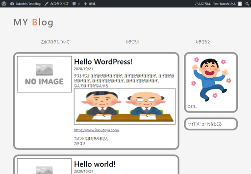
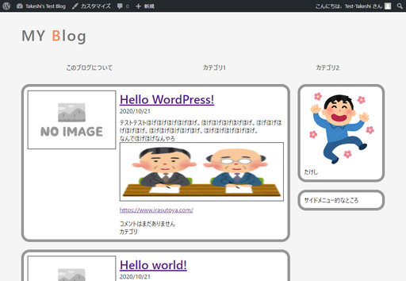
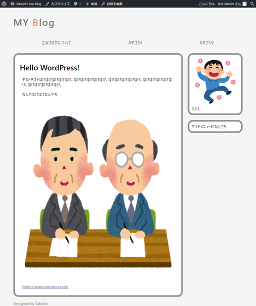
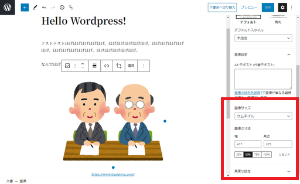
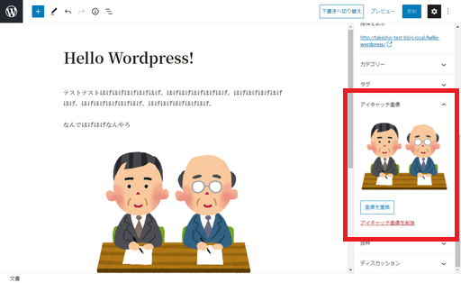
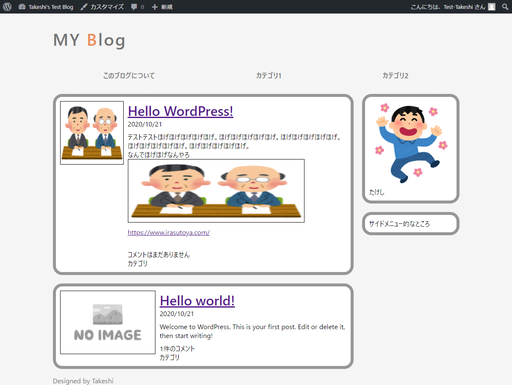
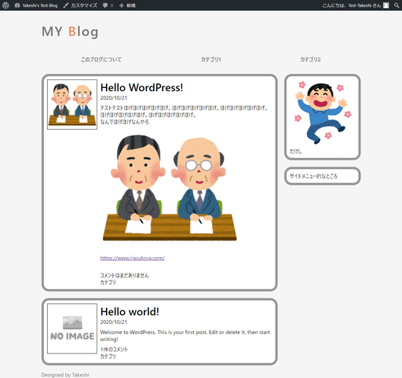

# 記事単独のページを作る

記事を単独で表示させるページ。

## 環境

- ローカル（PC側）
  - Windows10
  - PowerShell 5.1
- リモート（Raspberry Pi）
  - Raspberry Pi 3B+
  - Raspberry Pi OS 10.4
  - Nginx 1.14.2
  - PHP 7.3.19-1~deb10u1
  - WordPress 5.5.3-ja

## 準備

固定ページでは画像のことは特に気にしてなかったが、通常の記事では画像が入ることを想定して以前に適当に書いた「Hello WordPress!」というタイトルの記事に画像を入れる。

入れる画像。

入れた後のトップページ。

あ、表示が崩れた。

画像も入れるけどアイキャッチ画像も欲しい。

## 作業概要

1. トップページに個別記事へのリンクを張る
2. 固定ページのテンプレートを流用して記事ページのテンプレートを作成
3. アイキャッチ画像を有効化する。
4. 崩れている見た目を直すためにCSSを修正

## 作業

### トップページに個別記事へのリンクを張る

参考：[テンプレートタグ/the permalink \- WordPress Codex 日本語版](http://wpdocs.osdn.jp/%E3%83%86%E3%83%B3%E3%83%97%E3%83%AC%E3%83%BC%E3%83%88%E3%82%BF%E3%82%B0/the_permalink)

リンクの生成はループ内に以下を記述することでできる。

~~~php
<?php echo the_permalink( $post ); ?>
~~~

こうすると以下の文字列が出力される。

~~~
例えばこんな感じ
https://arcticstreet.ddns.net/wordpressblog/hello-wordpress
~~~

そのまんまURL文字列が出力されるので、`<a>`タグの`href`属性の場所に書いてやるとOK。

`index.php`に記入。

~~~php+HTML
<section>
    

        <a href="<?php echo the_permalink( $post ); ?>"><h1><?php the_title(); ?></h1></a>
        
<time>2020/10/21</time>

    

        

        <?php the_content(); ?>
    

    

        
<?php comments_number(); ?>

        
カテゴリ

    

</section>
~~~

見た目。

リンクの装飾設定してないからダサい。

### 固定ページのテンプレートを流用して記事ページのテンプレートを作成

これは固定ページのテンプレート`page.php`の中身をそのまま`single.php`として保存してやるだけ。

以下を`single.php`として保存。

~~~php+HTML
<?php get_header(); ?>

    <main>
        

            

                <?php if ( have_posts() ) : while ( have_posts() ) : the_post(); ?>
                    

                        

                            

                                <section>
                                    

                                        <h1><?php the_title(); ?></h1>
                                    

                                    

                                        <?php the_content(); ?>
                                    

                                    

                                    

                                </section>
                            

                        

                    

                <?php endwhile; endif; ?>
            

            

                <?php get_sidebar(); ?>
            

        

    </main>

<?php get_footer(); ?>
~~~

デカい。

これは元のサイズをそのまま表示しようとして縦は元のままだけど横はCSSにより無理矢理つぶされている。これの対策として、記事投稿時に画像の大きさを設定する。

普通に知らなかった。

### アイキャッチ画像を有効化する

アイキャッチ画像を設定するためには`functions.php`というファイルを作って、有効化するような記述をしないといけないらしい。

作成場所は他のテンプレートファイルと同じ場所でいいらしい。

`functions.php`を新規作成し、以下を記述。

~~~php
<?php
add_theme_support('post-thumbnails');
~~~

頭の`<?php`は必要だけど、[閉じタグは必要ないらしい](https://www.google.com/search?q=php+%E9%96%89%E3%81%98%E3%82%BF%E3%82%B0&oq=php+%E9%96%89%E3%81%98%E3%82%BF%E3%82%B0&aqs=chrome..69i57j0j0i5i30.4206j0j7&sourceid=chrome&ie=UTF-8)。

記事編集画面で設定できるようになった。

でもトップページで表示されないと意味がない。

### アイキャッチ画像をトップページで表示する

ここで大事になってくるのは

* アイキャッチ画像が設定されていない記事は「No Image」を表示
* アイキャッチ画像が設定されている記事は、そのアイキャッチ画像を表示

の判断。

参考資料：[テンプレートタグ/the post thumbnail \- WordPress Codex 日本語版](http://wpdocs.osdn.jp/%E3%83%86%E3%83%B3%E3%83%97%E3%83%AC%E3%83%BC%E3%83%88%E3%82%BF%E3%82%B0/the_post_thumbnail)

こんな感じでどうでしょう。

~~~
<?php
    if ( has_post_thumbnail()) {
        the_post_thumbnail( 'thumbnail' );
    } else {
        echo '';
    }
?>
~~~

上記の内容を`index.php`のNo Image画像タグと置き換えてやる。

`index.php`

~~~php+HTML
～略～

    

        <?php
            if ( has_post_thumbnail()) {
                the_post_thumbnail( 'thumbnail' );
            } else {
                echo '';
            }
        ?>
        <section>
            

～略～
~~~

画像の大きさがそろってないけど一応できた。上の記事は設定したサムネイルが表示されているけど、下の記事はNo Imageになってる。

### 崩れている見た目を整えるためにCSS修正

* サムネイルに設定したつもりの`height: 150px`が記事内の画像にも適用されている

  →`.article_summary`内の`img`タグへのスタイリングが原因なので、アイキャッチ画像は`thumnail`クラスを付与した`div`タグで包んで、その配下の`img`タグにスタイリングを施す。

  `index.php`

  ~~~php+HTML
  

      

          
    <!-- ← divタグ追記 -->
              <?php
                  if ( has_post_thumbnail()) {
                      the_post_thumbnail( 'thumbnail' );
                  } else {
                      echo '';
                  }
              ?>
          

          <section>
              

  ~~~

  `mystyle.css`

  ~~~css
  .article_summary .thumbnail img{  /* ← .thumbnail追記 */
      border: black solid 1px;
      margin-right:10px;
      height: 150px;
  }
  ~~~

  

* 記事へのリンクがデフォルト色

  →`.article_summary_header`内の`a`タグに`text-decoration: none`を施す。

  `mystyle.css`

  ~~~css
  /* どこか適当な場所に以下を追記 */
  
  .article_summary_header a{
      text-decoration: none;
      color: black;
  }
  ~~~

* そもそもサムネイルの大きさ、これでいいのか？

  →No Image画像を画像編集ソフト（というかWindows付属のPaint）で編集して150x150に縮めた。

変えたのがこちら。

センスは相変わらず行方不明だけど、まあ整っていると言えば整っている。記事タイトルが一応リンクになってるけどこれじゃ分かりにくいかな？まあいいや。

## 参考

[アイキャッチ画像の設定項目が表示されない問題を修正 \- WordPressカスタマイズ](https://umebius.com/wordpress/settings-eyecatch/)