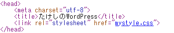
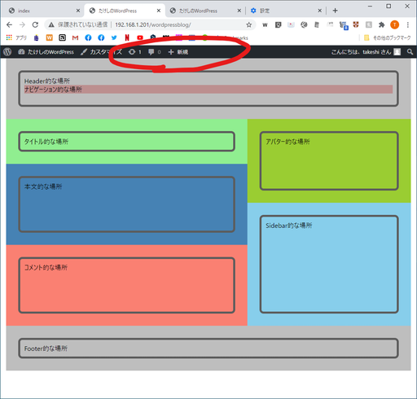

# 最小構成のページを作成する

## やりたいこと

WordPressがどうやって記事を表示させているのか仕組みを知るために、まずは最低限のことしか書かれていない超シンプルなページを作る。

## 環境

- ローカル（PC側）
  - Windows10
  - PowerShell 5.1
- リモート（Raspberry Pi）
  - Raspberry Pi 3B+
  - Raspberry Pi OS 10.4
  - Nginx 1.14.2
  - PHP 7.3.19-1~deb10u1
  - WordPress 5.5.1-ja

## 警告

以下の方法を行う前に、管理画面にログインするURLをブックマークしておくこと。今回の作業ではこのページへのリンクを一旦消す。多分`(WordPressのURL)/wp-login.php`で行けると思うけど、念のため。

## 方法

### ファイルの準備

ローカル上で適当にフォルダを作り、以下の`index.php`、`mystyle.css`、`style.css`を作成。コピペで可。

`index.php`：

~~~php+HTML
<!DOCTYPE html>
<html lang="ja">
<head>
	<meta charset="utf-8">
	<title>たけしのWordPress</title>
	<link rel="stylesheet" href="mystyle.css">
</head>
<body>
	<header>
        

            
Header的な場所

            <nav>ナビゲーション的な場所</nav>
        

    </header>
    <main>
        

            

                

                    
タイトル的な場所

                

            

            

                

                    
本文的な場所

                

            

            

                

                    
コメント的な場所

                

            

        

        

            

                

                    
アバター的な場所

                

            

            

                

                    
Sidebar的な場所

                

            

        

    </main>
	<footer>
		

            
Footer的な場所

		

	</footer>
</body>
</html>
~~~

`mystyle.css`：

~~~css
* {
    padding:0;
    margin:0;
    box-sizing: border-box;
}

body {
    max-width: 1000px;
    margin: 0 auto;
    font-family: "Yu gothic UI";
}

.container {
    height: 100%;
    width: 100%;
    padding: 10px;
    border: thick solid #5c5c5c;
    border-radius: 10px;
}

/* ヘッダー */
header {
    height: 150px;
    padding: 30px;
    background-color: #bebebe;
}

/* ナビゲーション */
nav {
    background-color: rosybrown;
}

/* メインコンテンツ */
main {
    display: flex;
}

.main-left {
    flex-grow: 2;
}

.main-right {
    flex-grow: 1;
    display: flex;
    flex-direction: column;
}

/* 記事タイトル */
.post-title {
    padding: 30px;
    background-color: lightgreen;
}

/* 記事本文 */
.post-contents {
    height: 200px;
    padding: 30px;
    background-color: steelblue;
}

/* コメント */
.post-comments {
    height: 200px;
    padding: 30px;
    background-color: salmon;
}

/* アバター */
.avatar {
    padding: 30px;
    background-color: yellowgreen;
    flex-grow: 1;
}

/* サイドバー */
.sidebar {
    padding: 30px;
    background-color: skyblue;
    flex-grow: 2;
}

/* フッター */
footer {
    padding: 30px;
    background-color: #bebebe;
}

footer .container{
    justify-content: space-between;
}
~~~

`style.css`：

~~~css
/*
Theme Name : Takeshi-theme
*/
~~~

PHP要素はまだ一切使っていないので、`index.php`を一旦`index.html`にリネームしてダブルクリックするとブラウザが立ち上がってどんなページなのか確認できる。

分かりやすいようにできるだけシンプルにしてみた。HTMLなんかは知識が無くても読めばなんとなく分かると思う。`
`は何で入れるのかわからん。Progateでそうやれって言ってた。でも入れると便利。

### ファイルをアップロード

`index.php`、`mystyle.css`、`style.css`を`scp`コマンドか何かでRaspberry Piにアップロード。アップロード先は

~~~
(WordPressをインストールしたディレクトリ)/wp-content/themes/(好きな名前のディレクトリ)
~~~

自分の場合、WordPressをインストールしたディレクトリは`/home/takeshi/www/html/wordpressblog`であり、`wp-content/themes`の中に`takeshi-test`ディレクトリを作成したから、アップロード先は

~~~
/home/takeshi/www/html/wordpressblog/wp-content/themes/takeshi-test
~~~

となる。

ディレクトリ作成は[ここ](../startup/aboutlinux.html)、`scp`コマンドでのアップロードは[ここ](../webserver/update1.html)を参考にする。

もし[以前作った同期スクリプト](/webserver/sync2.html)を使う場合、`$targetFolderName`と`$remoteFolder`の設定を変更すること。以下は自分の場合。`$targetFolderName`はスクリプトがある場所から上の3つのファイルがあるフォルダまでの相対パス。

~~~powershell
$targetFolderName = "\test\html\wordpressblog\wp-content\themes\takeshi-test"
$remoteFolder = "/home/takeshi/www/html/wordpressblog/wp-content/themes/takeshi-test"
~~~

### WordPress内でテーマを設定

WordPressにログインして「外観」を開くと、今アップしたテーマが追加されているので有効化する。

見た目がこちら。

ソースを覗くと、そのまんまアップされているので正しくCSSにリンクされていない。

WordPressのURLは、同一ネットワークから接続したとすると

~~~
http://192.168.1.201/wordpressblog
~~~

なので、上記のリンクだと、CSSファイルは

~~~
http://192.168.1.201/wordpressblog/mystyle.css
~~~

にあることになっている。でも実際にCSSファイルが存在するのは

~~~
http://192.168.1.201/wordpressblog/wp-content/themes/takeshi-test/mystyle.css
~~~

なので、リンクを修正する必要がある。

### リンクを修正する

~~~php+HTML
<link rel="stylesheet" href="mystyle.css">
↓
<link rel="stylesheet" href="<?php echo get_template_directory_uri(); ?>/mystyle.css">
~~~

そうするとちゃんと表示される。

### `wp_head()`と`wp_footer()`を挿入する

`</head>`タグの直前に`<?php wp_head(); ?>`を挿入する。

~~~php+HTML
<head>
    ...
    <?php wp_head(); ?>
</head>
~~~

同様に`</body>`の直前にも`<?php wp_footer(); ?>`を挿入する。

~~~php+HTML
<body>
    ...
    <?php wp_footer(); ?>
</body>
</html>
~~~

ログインした状態でWordPressを開いたら見える管理メニューが出てきた

どうもこれは必須の関数らしい。

## まとめ

WordPressに必要な最小構成とは

~~~
WordPressインストールディレクトリ
　└wp-content-themes-(任意の名前)
　　　　　　　　　　　　　　├index.php
　　　　　　　　　　　　　　├mystyle.css
　　　　　　　　　　　　　　└style.css
~~~

の3つ。いや、「自分はCSSなんていらないんだ！」という人は`mystyle.css`もいらないかな。

`index.php`には

* CSSファイルへのリンクの修正
* `<?php wp_head(); ?>`と`<?php wp_footer(); ?>`の挿入

が必要。

## 解説

### `<?php ~~ ?>`とは

[PHP編](../php/)でざっくり説明していくけど、簡単に説明すると`<?php ~~ ?>`はHTMLに埋め込まれたPHPのプログラムコード。`~~`の部分が実際に実行される部分。

例えば`<?php echo get_template_directory_uri(); ?>`では以下のコードが実行されている。

~~~php
echo get_template_directory_uri();
~~~

`echo "文字列"`でその文字列を出力、`get_temeplate_directory_uri()`はWordPress専用の関数。テーマファイルが入ったディレクトリまでのフルパスを文字列として出力してくれるらしい。