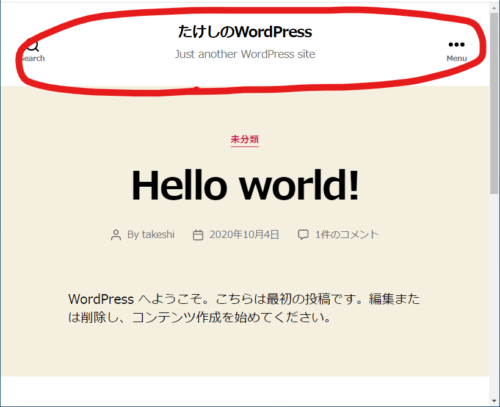
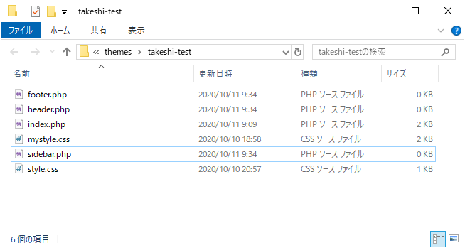

# ファイル分割について知る

[前回](customtheme1.html)に引き続き`index.php`を編集していく。

例えばブログタイトルなどを表示するような部分はどんなページを開いても常に表示されるようにしたい。

全てのページに表示させるようにするには全てのページにこれを表示するコードを書かないといけないけど、修正するとなったら全て修正しないといけないので大変。

だからヘッダーの部分だけ別ファイル（`header.php`）にしておいて、全てのページに「`header.php`を呼び出せ」というコードを書いていく。そうすると修正が必要となったときに`header.php`のみ修正すればよいことになる。

フッターとサイドバーも同様にする。

## 環境

- ローカル（PC側）
  - Windows10
  - PowerShell 5.1
- リモート（Raspberry Pi）
  - Raspberry Pi 3B+
  - Raspberry Pi OS 10.4
  - Nginx 1.14.2
  - PHP 7.3.19-1~deb10u1
  - WordPress 5.5.1-ja

## 方法

[前回](customtheme1.html)作った`index.php`、`mystyle.css`、`style.css`と同じ場所に、新規で`header.php`、`footer.php`、`sidebar.php`を作成する。

### `header.php`の編集

`index.php`の以下の部分を丸ごと`header.php`に移し替える。

`header.php`（`index.php`から抜き出す部分）

~~~php+HTML
<!DOCTYPE html>
<html lang="ja">
<head>
	<meta charset="utf-8">
	<title>たけしのWordPress</title>
	<link rel="stylesheet" href="<?php echo get_template_directory_uri(); ?>/mystyle.css">
    <?php wp_head(); ?>
</head>
<body>
	<header>
        

            
Header的な場所

            <nav>ナビゲーション的な場所</nav>
        

    </header>
~~~

そして、`index.php`の抜けたところに`<?php get_header(); ?>`を記述する。

`index.php`

~~~php+HTML
<?php get_header(); ?>

    <main>
        ...
~~~

これで実際にアクセスして表示が変わらなければOK。キャッシュクリアに注意。

アクセス時に起こることは、`index.php`内の`<?php get_header(); ?>`部分が`header.php`の中身に丸ごと置き換わる。例えば、`index2.php`とか`index3.php`とかを新たに作ったとして（そんな名前では普通作らないけど）全ての先頭に`<?php get_header(); ?>`を書いておけば、毎回`header.php`の内容に置き換えるので、ヘッダー部分を編集するときは`header.php`だけでいいというわけ。

### `footer.php`の編集

同様にフッター部分も`footer.php`に分割する。

`footer.php`（`index.php`から抜き出す部分）

~~~php+HTML
	<footer>
		

            
Footer的な場所

		

	</footer>
    <?php wp_footer(); ?>
</body>
</html>
~~~

`index.php`（`<?php get_footer(); ?>`に置き換える部分）

~~~php+HTML
		...
	</main>

<?php get_footer(); ?>
~~~

### `sidebar.php`の編集

`sidebar.php`（`index.php`から抜き出す部分）

~~~php+HTML
            

                

                    
アバター的な場所

                

            

            

                

                    
Sidebar的な場所

                

            

~~~

`index.php`（`<?php get_sidebar(); ?>`を挿入する部分）

~~~php+HTML
        

            <?php get_sidebar(); ?>
        

    </main>
~~~

### 残った`index.php`のコード

結局`index.php`はどうなってしまったのか。最終版がこれ。

~~~php+HTML
<?php get_header(); ?>

    <main>
        

            

                

                    
タイトル的な場所

                

            

            

                

                    
本文的な場所

                

            

            

                

                    
コメント的な場所

                

            

        

        

            <?php get_sidebar(); ?>
        

    </main>

<?php get_footer(); ?>
~~~

ずいぶんシンプルになった。今後ヘッダー、フッター、サイドバーはそれぞれ分割したファイルに担当させたらよいということになったので、`index.php`では記事を表示させることに集中させる。