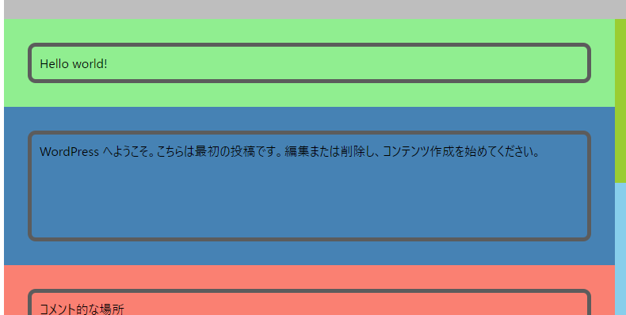
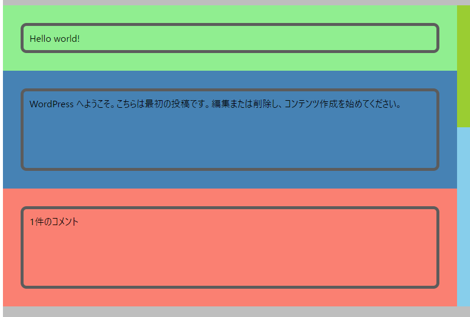
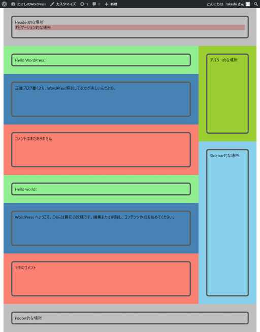

# 記事の内容をとりあえず表示させる

## やりたいこと

[前回](customtheme2.html)に引き続き、今回は`index.php`に記事の内容を表示させる。

今回はとりあえずインストール時に自動で作成された「Hello world!」というタイトルの記事に対して

* タイトルを取得
* 記事内容を取得
* コメント数を取得

を目指す。とりあえず表示させることが目標で、「トップページなんだったら記事一覧にしなきゃ」とか「見た目がヤバい」とかそういうことは考えない。

## 環境

- ローカル（PC側）
  - Windows10
  - PowerShell 5.1
- リモート（Raspberry Pi）
  - Raspberry Pi 3B+
  - Raspberry Pi OS 10.4
  - Nginx 1.14.2
  - PHP 7.3.19-1~deb10u1
  - MariaDB 10.3
  - WordPress 5.5.1-ja

## 前提

[MariaDBの中を覗いて](checkdb.html)みたら、一番最初の記事「Hello world!」は

* `ID`：1

* `post_title`：Hello world!

* `post_content`：

  ~~~
  <!-- wp:paragraph -->
  
WordPress へようこそ。こちらは最初の投稿です。編集または削除し、コンテンツ作成を始めてください。

  <!-- /wp:paragraph -->
  ~~~

となっているらしい。

また、編集前の`index.php`は以下のようになっている。

~~~php+HTML
<?php get_header(); ?>

    <main>
        

            

                

                    
タイトル的な場所

                

            

            

                

                    
本文的な場所

                

            

            

                

                    
コメント的な場所

                

            

        

        

            <?php get_sidebar(); ?>
        

    </main>

<?php get_footer(); ?>
~~~

## 概要

1. 記事取得ループを作る

   ~~~php+HTML
   <?php if ( have_posts() ) : while ( have_posts() ) : the_post(); ?>
   
   <?php endwhile; endif; ?>
   ~~~

2. ループ内に以下の関数を書く

   * `<?php the_title(); ?>`：記事タイトルを取得し文字列として出力
   * `<?php the_content(); ?>`：記事本文を取得し`
`タグなどが付いたブロックを出力
   * `<?php comments_number(); ?>`：コメント件数を取得し文字列として出力

## 方法

### ループの作成

どのサイト見ても「ループ」としか呼んでないけど、おそらくコードから「記事が見つかる限り続く`while`ループ」ということが言える。

~~~php
if ( have_posts() ) {
    while ( have_posts() ) {
        the_post();
        （ここに色々書く）
    }
}
~~~

おそらく`have_posts()`の戻り値は`True`または`False`で、`the_post();`で次の記事の情報を変数にセットしているような初期化関数みたいな感じ。

このままではHTMLに埋め込んだ時に非常に見にくくなるので、整形する。

~~~php+HTML
<?php
if ( have_posts() ) :
	while ( have_posts() ) :
		the_post();
?>
        （ここに色々書く）
<?php
	endwhile;
endif;
?>
~~~

改行はあっても無くてもどっちでもいいので、さらに整形する。

~~~php+HTML
<?php if ( have_posts() ) : while ( have_posts() ) : the_post(); ?>
        （ここに色々書く）
<?php endwhile; endif; ?>
~~~

この最初と最後の行で挟まれた部分を「ループ内」と呼ぶ。

ループ内で使える関数がいろいろあり、その中にタイトル文と記事本文を取得する関数もある。

ループを実際に`index.php`に埋め込む。

~~~php+HTML
<?php get_header(); ?>

    <main>
        

            <?php if ( have_posts() ) : while ( have_posts() ) : the_post(); ?>
                

                    

                        
タイトル的な場所

                    

                

                

                    

                        
本文的な場所

                    

                

                

                    

                        
コメント的な場所

                    

                

            <?php endwhile; endif; ?>
        

        

            <?php get_sidebar(); ?>
        

    </main>

<?php get_footer(); ?>
~~~

「タイトル的な場所」「本文的な場所」「コメント的な場所」がループ内に入っている。

### 記事のタイトルと本文を取得

* タイトルを取得する関数：`the_title()`　→　ただの文字列を出力。

* 本文を取得する関数：`the_content()`　→　`
`タグで囲まれている文字列を出力。

ということなので、「タイトル的な場所」と「本文的な場所」を以下の様に置き換える。

~~~php+HTML
<?php get_header(); ?>

    <main>
        

            <?php if ( have_posts() ) : while ( have_posts() ) : the_post(); ?>
                

                    

                        
<?php the_title(); ?>

                    

                

                

                    

                        <?php the_content(); ?>
                    

                

                

                    

                        
コメント的な場所

                    

                

            <?php endwhile; endif; ?>
        

        

            <?php get_sidebar(); ?>
        

    </main>

<?php get_footer(); ?>
~~~

タイトル的な場所にタイトルが入り、本文的な場所に本文が入った。

### コメントの件数表示

どうもコメントは`index.php`では表示しないみたい。なのでせめてコメントの件数を表示するようにする。

`<?php comments_number(); ?>`でコメント件数に応じた文字列が出力されるとのこと。`()`の中に3つの文字列を引数として渡せば、0件のとき、1件のとき、2件以上のときの文字列を指定することができるらしい。

参考：[テンプレートタグ/comments number \- WordPress Codex 日本語版](https://wpdocs.osdn.jp/%E3%83%86%E3%83%B3%E3%83%97%E3%83%AC%E3%83%BC%E3%83%88%E3%82%BF%E3%82%B0/comments_number)

これを`index.php`の中の「コメント的な場所」に埋め込む。

~~~php+HTML
<?php get_header(); ?>

    <main>
        

            <?php if ( have_posts() ) : while ( have_posts() ) : the_post(); ?>
                

                    

                        
<?php the_title(); ?>

                    

                

                

                    

                        <?php the_content(); ?>
                    

                

                

                    

                        
<?php comments_number(); ?>

                    

                

            <?php endwhile; endif; ?>
        

        

            <?php get_sidebar(); ?>
        

    </main>

<?php get_footer(); ?>
~~~

「1件のコメント」と表示された。実際この最初の記事には1件コメントが自動で挿入されている。

### 試しにもう1件記事を増やしてみる

記事を適当に投稿してみた。

2記事が表示された。とりあえず色がキツい。

