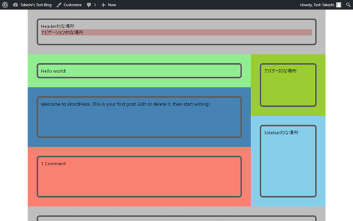
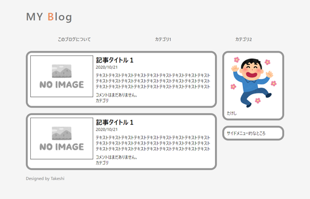
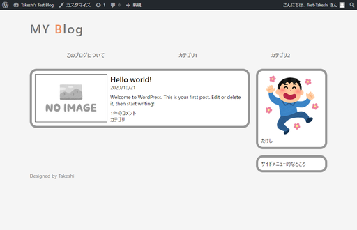
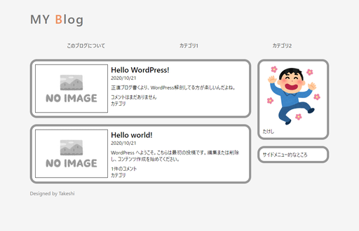

# 見た目をもうちょっと整える

やはりこれはあんまりにもひどいので見た目を整え

ました。

そんなにすごくないけど、まあブログっぽいかな。これでも作るのに2週間ほどかかった。

## HTMLとCSSのソースコード（分割前）

以下にソースを貼っておくので、[ファイル分割について知る](customtheme2.html)と[記事の内容をとりあえず表示させる](customtheme3.html)を参考にして

* `index.php`
* `header.php`
* `footer.php`
* `sidebar.php`
* `style.css`
* `mystyle.css`

に分割したうえで、DB内に保存されている記事を表示させてみよう。

HTMLソース

~~~html
<!DOCTYPE html>
<html lang="ja">
<head>
    <meta charset="utf-8">
    <title>たけしのWordPress</title>
    <link rel="stylesheet" href="mystyle.css">
</head>
<body>
    <header>
        

            

                <a href="index.html" alt="Blog Link">MY Blog</a>
            

            

                <nav>
                    <ul>
                        <li><a href="index.html">このブログについて</a></li>
                        <li><a href="index.html">カテゴリ1</a></li>
                        <li><a href="index.html">カテゴリ2</a></li>
                    </ul>
                </nav>
            

        

    </header>
    <main>
        

            

                

                    

                        

                            
                            <section>
                                

                                    <h1>記事タイトル１</h1>
                                    
<time>2020/10/21</time>

                                

                                

                                    
テキストテキストテキストテキストテキストテキストテキストテキストテキストテキストテキストテキストテキストテキストテキストテキストテキストテキストテキストテキストテキストテキストテキストテキストテキストテキストテキスト

                                

                                

                                    
コメントはまだありません。

                                    
カテゴリ

                                

                            </section>
                        

                    

                

                

                    

                        

                            
                            <section>
                                

                                    <h1>記事タイトル１</h1>
                                    
<time>2020/10/21</time>

                                

                                

                                    
テキストテキストテキストテキストテキストテキストテキストテキストテキストテキストテキストテキストテキストテキストテキストテキストテキストテキストテキストテキストテキストテキストテキストテキストテキストテキストテキスト

                                

                                

                                    
コメントはまだありません。

                                    
カテゴリ

                                

                            </section>
                        

                    

                

            

            

                

                    

                        

                            
                            
たけし

                        

                    

                

                

                    

                        

                            
サイドメニュー的なところ

                        

                    

                

            

        

    </main>
    <footer>
        

            

                

                

                

                    
Designed by <a href="https://arcticstreet.ddns.net/">Takeshi</a>

                

            

        

    </footer>
</body>
</html>
~~~

CSSソース

~~~css
* {
    padding:0;
    margin:0;
    box-sizing: border-box;
}

body {
    font-family: "Yu gothic UI";
    background-color: #f5f5f5;
}

.wrapper {
    padding: 0 10px;
    margin: 0 auto;
    width: 100%;
    max-width: 1000px;

}

.container {
    padding: 0 10px;
}

/* ヘッダー */
header{
    color: #737373;
}

header a {
    text-decoration: none;
    color: #737373;
}

/* タイトル */

.site-title{
    height: 120px;
    display: table-cell;
    vertical-align: middle;
}

.site-title a{
    text-align: center;
    font-size: 40px;
    font-weight: bold;
    letter-spacing: 3px;
}

.site-title span{
    color: #ED8F5C;
}

/* ナビゲーションバー */

nav ul{
    height: 50px;
    display: flex;
    justify-content: space-between;
    list-style: none;
    align-items: center;
}

nav ul li{
    padding: 0 auto;
    flex-grow: 1;
    text-align: center;
    font-weight: bold;
    font-size: 13pt;
}

/* メイン */

main{
    margin-top: 20px;
}

main .wrapper{
    display: flex;
}

.sidebar{
    width: 250px;
}

.border_outer {
    padding: 7px;
    background-color: #969696;
    border-radius: 22px;
}

.border_inner {
    background-color: white;
    border-radius: 15px;
    padding: 10px;
}

.article_outer {
    margin-bottom: 20px;
}

.article_summary{
    display: flex;
    min-width: 400px;
}

.article_summary img{
    border: black solid 1px;
    margin-right:10px;
    height: 155px;
}

.article_summary_header {
    margin-bottom: 10px;
}

.article_summary_footer {
    margin-top: 10px;
}

.sidemenu {
    margin-top: 20px;
}

/* フッター */
.footer p{
    color: #737373;
}
  
.footer a{
    text-decoration: none;
    color: #737373;
}
~~~

画像（[いらすとや](https://www.irasutoya.com/)より：大きさを縮小）　`image`フォルダを`index.php`と同じ場所に作って、その中に保存。

`rs-no_image_yoko.jpg`

`rs-pose_dance_ukareru_man.png`

## ローカルでテスト

せっかく前回の記事でローカル上にテスト環境を作成したので、ローカルでちゃんと表示されるかテスト。

良さげ。

## アップロードを自動化

[以前作ったアップロードスクリプト](../webserver/sync2.html)を利用して

1. ローカル上で`index.php`などを編集
2. ローカル上で見た目を確認
3. アップロードスクリプトのショートカットをダブルクリック
4. リモート上で見た目を確認

の流れにしていきたい。今は2.までできているとする。

### 状況整理

ローカルのフォルダ：`C:\Users\(ユーザー名)\Local Sites\takeshis-test-blog\app\public\wp-content\themes`の中身を以下の様にする。

~~~
id_rsa (以前作ったuploadユーザー用の秘密鍵)
lasttime.dat (sync.ps1が自動で作るファイル)
sync.ps1 (以前作ったアップロードスクリプト)
index.php (WordPressが自動で作るファイル)
twentynineteen
  └色々
twentyseventeen
  └色々
twentytwenty
  └色々
takeshi-test
　├index.php
　├header.php
　├footer.php
　├sidebar.php
　├style.css
　├mystyle.css
　└image
　  ├rs-no_image_yoko.jpg
　  └rs-pose_dance_ukareru_man.png
~~~

リモートのディレクトリ

`/home/takeshi/www/html/wordpressblog/wp-content/themes/takeshi-test`

`sync.ps1`の中身

~~~powershell
$targetFolderName = "/takeshi-test"
$remoteFolder = "/home/takeshi/www/html/wordpressblog/wp-content/themes/takeshi-test"
$remoteAddress = "upload@(Raspberry PiのIP)"
$keyName = "id_rsa"
$datName = "lasttime.dat"
$port = (ポート番号)

#--------------------------------------------------------------

Set-Location $PSScriptRoot

[datetime]$lastdate = (Get-Content $datName)
$targetFolder = $PSScriptRoot + $targetFolderName
$dirlist = (ssh $remoteAddress -i $keyName -p $port "tree -f -i -d --noreport $remoteFolder")

$itemList = Get-ChildItem $targetFolder -Recurse -File
foreach($item in $itemList)
{
    if ($item.LastWriteTime -gt $lastdate)
    {
        $s = (Split-Path $item.FullName -Parent)
        $localFolderName = $s.Substring($targetFolder.Length, $s.Length - $targetFolder.Length).Replace("\", "/")
        if($localFolderName -eq ""){
            $IsNewFolder = $false
        } else {
            $IsNewFolder = $true
            if($dirlist.GetType().Name -ne "String"){
                for ($i = 1; $i -le $dirlist.Length; $i++)
                {
                    $s = $dirlist[$i]
                    if ("$remoteFolder$localFolderName" -eq $s)
                    {
                        $IsNewFolder = $false
                        break
                    }
                }
            }
        }
        if ($IsNewFolder -eq $true)
        {
            ssh $remoteAddress -i $keyName -p $port "mkdir $remoteFolder$localFolderName"
            if($dirlist.GetType().Name -ne "String"){
                $dirlist += "$remoteFolder$localFolderName"
            } else {
                $dirlist = "$dirlist", "$remoteFolder$localFolderName"
            }
        }
        $fileName = $item.FullName.Substring($targetFolder.Length, $item.FullName.Length - $targetFolder.Length)
        scp -P $port -i $keyName $item.FullName "${remoteAddress}:$remoteFolder$fileName"
    }
}

(Get-Date).DateTime > $datName
$a = Read-Host "Press Enter"
~~~

`sync.ps1`のショートカットをデスクトップに作り、右クリックでプロパティを開き、「リンク先」を以下の文字列にする。

~~~
C:\Windows\System32\WindowsPowerShell\v1.0\powershell.exe -File "C:\Users\(ユーザー名)\Local Sites\takeshis-test-blog\app\public\wp-content\themes\sync.ps1"
~~~

必要であればPowerShellの実行ポリシーを変更しておく。

~~~shell
> Set-ExecutionPolicy RemoteSigned
~~~

作ったショートカットをダブルクリックするとアップロードが始まる。

## 確認

とりあえずこんなもんか。