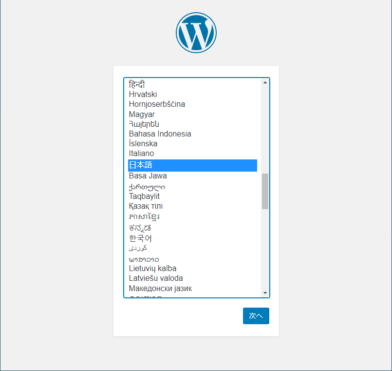
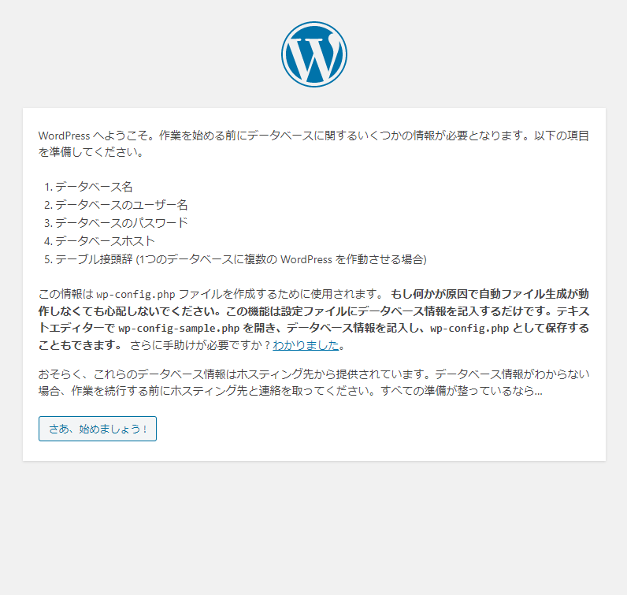
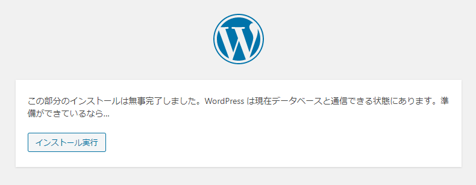
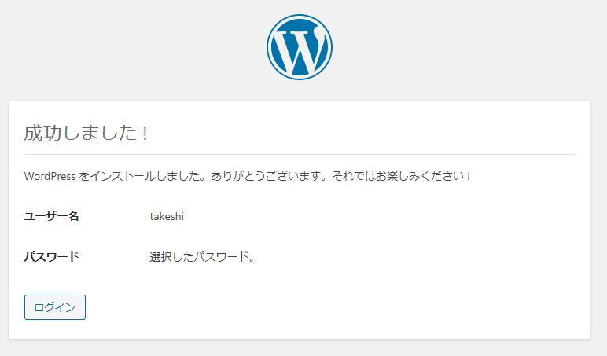

# Raspberry PiにMySQLとWordPressをインストールし、セットアップする

## 環境

- ローカル（PC側）
  - Windows10
  - PowerShell 5.1
- リモート（Raspberry Pi）
  - Raspberry Pi 3B+
  - Raspberry Pi OS 10.4
  - Nginx 1.14.2
  - PHP 7.3.19-1~deb10u1

## 前提

もうすでに[WebサーバーとしてNginx、そしてPHPが入っているものとする。](../webserver/nginx.html)

## 方法

### MariaDBをインストール

WordPressは記事の保存にいちいちファイルを作らず、DB（データベース）を使って保存していく。WordPressに必要なDBシステムがMySQLというもので、オープンソースかつ非商用なら無料。さらにそのMySQLから派生したのがMariaDBで、システムとしてはMySQLとほぼ同じ。多分。

MySQL自体はソフトウェアの一つだが、起動すると「ログイン」をしてDBモニターという状態になる。DBモニターが起動しているとき、DBの作成や削除などの操作ができる。

リモート上で

~~~shell
$ sudo apt install mariadb-server -y
~~~

MariaDBはMySQLの一種なので、`mysql`コマンドで起動できる。ただ、初期では`root`ユーザー出ないと立ち上がらない。バージョンは10.3らしい。

~~~shell
$ sudo mysql
Welcome to the MariaDB monitor.  Commands end with ; or \g.
Your MariaDB connection id is 53
Server version: 10.3.23-MariaDB-0+deb10u1 Raspbian 10

Copyright (c) 2000, 2018, Oracle, MariaDB Corporation Ab and others.

Type 'help;' or '\h' for help. Type '\c' to clear the current input statement.

MariaDB [(none)]>
~~~

`quit`と打てば終了できる。

~~~mysql
MariaDB [(none)]> quit
Bye
~~~

### MariaDBの設定

今はパスワードも何も設定されていないので、ちゃんと設定をする。

~~~shell
$ sudo mysql_secure_installation
~~~

以下、対話形式で設定をしていく。

最初は`root`ユーザーのパスワードを聞かれる。と言ってもこの`root`ユーザーはRaspberry Piのものではなく、MariaDB内の独自のユーザー。現在は何も設定していないので、空欄のままエンター。

~~~
NOTE: RUNNING ALL PARTS OF THIS SCRIPT IS RECOMMENDED FOR ALL MariaDB
      SERVERS IN PRODUCTION USE!  PLEASE READ EACH STEP CAREFULLY!

In order to log into MariaDB to secure it, we'll need the current
password for the root user.  If you've just installed MariaDB, and
you haven't set the root password yet, the password will be blank,
so you should just press enter here.

Enter current password for root (enter for none):
~~~

次に`root`ユーザー用のパスワードを設定するかと聞かれるので、大文字の`Y`を入力しエンター。パスワードを設定する。

※ここでのパスワード設定は意味無い。まあ一応とりあえず入力。詳しくは解説で。

~~~
Setting the root password ensures that nobody can log into the MariaDB
root user without the proper authorisation.

Set root password? [Y/n] Y
New password:
Re-enter new password:
~~~

匿名ユーザーを禁止する。匿名ユーザーとはテスト用のユーザーだそうだ。`Y`を入力しエンター。

~~~
By default, a MariaDB installation has an anonymous user, allowing anyone
to log into MariaDB without having to have a user account created for
them.  This is intended only for testing, and to make the installation
go a bit smoother.  You should remove them before moving into a
production environment.

Remove anonymous users? [Y/n] Y
~~~

`localhost`以外からのMySQLへのログインを禁止するかどうか。`Y`を入力しエンター。

~~~
Normally, root should only be allowed to connect from 'localhost'.  This
ensures that someone cannot guess at the root password from the network.

Disallow root login remotely? [Y/n] Y
~~~

`test`という名前のデータベースがテスト用にあるらしいけど、誰でもアクセスできるので削除するかどうか聞かれる。`Y`を入力してエンター。

~~~
By default, MariaDB comes with a database named 'test' that anyone can
access.  This is also intended only for testing, and should be removed
before moving into a production environment.

Remove test database and access to it? [Y/n] Y
~~~

これまでの設定を反映させるかどうか。`Y`を入力しエンター。

~~~
Reloading the privilege tables will ensure that all changes made so far
will take effect immediately.

Reload privilege tables now? [Y/n] Y
~~~

設定終了。

~~~
All done!  If you've completed all of the above steps, your MariaDB
installation should now be secure.

Thanks for using MariaDB!
~~~

### MariaDB内ユーザーの追加

再度DB内にログイン。

~~~shell
$ sudo mysql
~~~

以下を打つと`takeshi`ユーザーが、全権限付きで追加される。本来はすでに登録されているユーザーに対する権限追加コマンドだけど、ユーザーがDB内に存在しない場合自動で作られるみたい。

~~~mysql
MariaDB [(none)]> GRANT ALL PRIVILEGES ON *.* TO 'takeshi'@'localhost' IDENTIFIED BY '(MariaDB用のパスワード)';
~~~

変更した権限情報を有効にする。

~~~mysql
MariaDB [(none)]> FLUSH PRIVILEGES;
~~~

### WordPress用のデータベースを登録

WordPressが読み書きするためのデータベースを作る。

~~~mysql
MariaDB [(none)]> create database wordpress;
Query OK, 1 row affected (0.001 sec)
~~~

### WordPressがMariaDBにログインするためのユーザーを追加し権限を付与

後でWordPressの設定で出てくるけど、WordPressがMariaDBにログインしてデータを取ってこれるようにするため、専用のDB内ユーザーを作っておく。

適当に`wordpress`ユーザーとする。

~~~mysql
MariaDB [(none)]> GRANT ALL PRIVILEGES ON wordpress.* TO 'wordpress'@'localhost' IDENTIFIED BY '(MariaDB内のwordpressユーザーのパスワード)';
MariaDB [(none)]> FLUSH PRIVILEGES;
~~~

### WordPressをインストール

いよいよ本体をインストール。[前回](wordpressdirectory.html)の記事で作った`wordpressblog`ディレクトリに移動し、WordPress本体をダウンロード、展開して中身を`wordpressblog`ディレクトリに移し、残ったゴミを削除。

~~~shell
$ cd ~/www/html/wordpressblog
$ sudo wget http://wordpress.org/latest.tar.gz
$ sudo tar xzf latest.tar.gz
$ sudo mv wordpress/* .
$ sudo rm -rf wordpress latest.tar.gz
~~~

展開されたファイルを確認してみる。

~~~shell
$ tree -L 1
.
├── index.php
├── license.txt
├── readme.html
├── wp-activate.php
├── wp-admin
├── wp-blog-header.php
├── wp-comments-post.php
├── wp-config-sample.php
├── wp-content
├── wp-cron.php
├── wp-includes
├── wp-links-opml.php
├── wp-load.php
├── wp-login.php
├── wp-mail.php
├── wp-settings.php
├── wp-signup.php
├── wp-trackback.php
└── xmlrpc.php

3 directories, 16 files
~~~

所有者を変えておいた方がいいらしいので変える。

~~~shell
$ sudo chown -R www-data: .
~~~

### PHPとMySQLを連携させるための拡張機能をインストール

これが無いと動かんらしい。

~~~shell
$ sudo apt install php-mysql -y
~~~

### ブラウザからWordPressにアクセス

ブラウザのURL欄に`http://(Raspberry PiのIP)/wordpressblog`と打つ。

起動した。さあ、始めましょう！をクリック。

データベース接続のための詳細入力。ユーザー名はさっき作ったWordPress専用のMariaDB内ユーザー。パスワードも入力する。

準備ができているならインストール実行。

ブログのタイトル、WordPressにログインするためのユーザー名とパスワード、メールアドレスを入力。

インストール成功。

設定したユーザー名とパスワードを使ってログイン。

管理画面。

見た目をチェック。

ちゃんと動いているらしい。

## 解説

### MariaDBの`root`ユーザーにパスワードを設定しても意味無いのはなぜか。

ぶっちゃけて言うと認証に`unix_socket`なるものを使っているから。

> Using `unix_socket` means that if you are the system root user, you can login as `root@locahost` without a password. This technique was pioneered by Otto Kekäläinen in MariaDB packages in Debian as early as MariaDB 10.0. It is based on a simple fact, that asking the system root for a password adds no extra security — root has full access to all the data files and all process memory anyway. But *not* asking for a password means, there is no root password to forget (bye-bye numerous tutorials “how to reset MariaDB root password”). And if you want to script some tedious database work, there is no need to store the root password in plain text for the scipt to use (bye-bye `debian-sys-maint` user).
>
> [Authentication in MariaDB 10\.4 — Understanding the Changes \- MariaDB\.org](https://mariadb.org/authentication-in-mariadb-10-4/)

`unix_socket`認証とは、Linuxに現在ログインしているユーザー名+ホスト名とDB内に登録されているユーザー名+ホスト名が一致してたらパスワードが要らないというもの。で、上の英語はざっくり言うと「`root`ユーザーになってる時点で何でもできるんだから、セキュリティとか要らないでしょ。だから`unix_socket`認証にして余計なパスワードを設定しなくてもいいようにしたよ」ということ。

でもこれはMariaDB 10.4の話。なんでRaspberry Piに10.3が入るのか、10.3でもrootの認証は`unix_socket`なのかは謎。

でもMariaDB内に`takeshi`ユーザーを全権限付きで追加した後、MariaDBにログインして`SELECT user, host, plugin FROM mysql.user;`を打ってみると

~~~mysql
MariaDB [(none)]> SELECT user, host, plugin FROM mysql.user;
+---------+-----------+-------------+
| user    | host      | plugin      |
+---------+-----------+-------------+
| root    | localhost | unix_socket |
| takeshi | localhost |             |
+---------+-----------+-------------+
2 rows in set (0.001 sec)
~~~

確かに`root`ユーザーには`unix_socket`認証が設定されている。

試しに`takeshi`ユーザーに`unix_socket`認証でログインするように設定する。

~~~mysql
MariaDB [(none)]> UPDATE mysql.user SET plugin='unix_socket' WHERE user='takeshi';
Query OK, 1 row affected (0.001 sec)
Rows matched: 1  Changed: 1  Warnings: 0

MariaDB [(none)]> SELECT user, host, plugin FROM mysql.user;
+---------+-----------+-------------+
| user    | host      | plugin      |
+---------+-----------+-------------+
| root    | localhost | unix_socket |
| takeshi | localhost | unix_socket |
+---------+-----------+-------------+
2 rows in set (0.001 sec)
~~~

DBからログアウトして再起動後、再度ログインしてみる。

~~~shell
$ sudo service mysql restart
$ mysql
Welcome to the MariaDB monitor.  Commands end with ; or \g.
Your MariaDB connection id is 36
Server version: 10.3.23-MariaDB-0+deb10u1 Raspbian 10

Copyright (c) 2000, 2018, Oracle, MariaDB Corporation Ab and others.

Type 'help;' or '\h' for help. Type '\c' to clear the current input statement.

MariaDB [(none)]>
~~~

パスワード無しで入れた。

面白いのは、`unix_socket`認証を設定すると、`sudo`コマンドでは入れない。

~~~shell
$ sudo mysql -u takeshi -p
Enter password:（何を入力してもダメ、設定済みのパスワードでもダメ）
ERROR 1698 (28000): Access denied for user 'takeshi'@'localhost'
~~~

元に戻すには、DBにログインしてから`UPDATE mysql.user SET plugin='' WHERE user='takeshi';`を打つ。

~~~mysql
MariaDB [(none)]> UPDATE mysql.user SET plugin='' WHERE user='takeshi';
Query OK, 1 row affected (0.001 sec)
Rows matched: 1  Changed: 1  Warnings: 0

MariaDB [(none)]> SELECT user, host, plugin FROM mysql.user;
+---------+-----------+-------------+
| user    | host      | plugin      |
+---------+-----------+-------------+
| root    | localhost | unix_socket |
| takeshi | localhost |             |
+---------+-----------+-------------+
2 rows in set (0.001 sec)

MariaDB [(none)]> quit
Bye
~~~

またパスワードを要求されるようになった。

~~~shell
$ mysql
ERROR 1045 (28000): Access denied for user 'takeshi'@'localhost' (using password: NO)
~~~

### DBとはそもそも

※自分なりの解釈。正確な説明が知りたかったら自分で検索。

DBとは、Excelみたいなもの。中に表がいっぱい詰まってるファイルのこと。ただし、Excelは開くことすら時間がかかるのに対して、DBは目的の表をいかに素早く引き出すかに命をかけている。

また、Excelと違ってDB内に保存されている表またはデータは「直接目で確認する必要は無いもの」と割り切っているので、DBファイルを直接開くことはそもそも無い。だからPHPなどのプログラムを通してデータにアクセスする。

ただ、DBを直接操作したいときもあるので、DBを操作するだけのソフトがある。それを「モニター」と呼ぶ。

今回

~~~shell
$ sudo mysql
~~~

で起動したのが「MySQLモニター」。

DBファイルは`/var/lib/mysql`に保管されている。保管場所をデータディレクトリと呼ぶ。

~~~shell
$ cd /var/lib/mysql
$ ls -al
total 122952
drwxr-xr-x  5 mysql mysql     4096 Oct  4 21:55 .
drwxr-xr-x 45 root  root      4096 Oct  4 17:57 ..
-rw-rw----  1 mysql mysql    16384 Oct  4 20:03 aria_log.00000001
-rw-rw----  1 mysql mysql       52 Oct  4 20:03 aria_log_control
-rw-r--r--  1 root  root         0 Oct  4 17:58 debian-10.3.flag
-rw-rw----  1 mysql mysql      976 Oct  4 20:03 ib_buffer_pool
-rw-rw----  1 mysql mysql 12582912 Oct  4 23:06 ibdata1
-rw-rw----  1 mysql mysql 50331648 Oct  4 23:06 ib_logfile0
-rw-rw----  1 mysql mysql 50331648 Oct  4 17:58 ib_logfile1
-rw-rw----  1 mysql mysql 12582912 Oct  4 20:03 ibtmp1
-rw-rw----  1 mysql mysql        0 Oct  4 17:58 multi-master.info
drwx------  2 mysql mysql     4096 Oct  4 17:58 mysql
-rw-rw----  1 root  root        16 Oct  4 17:58 mysql_upgrade_info
drwx------  2 mysql mysql     4096 Oct  4 17:58 performance_schema
-rw-rw----  1 mysql mysql    24576 Oct  4 20:03 tc.log
drwx------  2 mysql mysql     4096 Oct  4 22:54 wordpress
~~~

この中の`mysql`と`wordpress`と`performance_schema`がディレクトリになっている。

記事中で作ったのは`wordpress`というDBなので`wordpress`ディレクトリの中身を見てみる。権限の関係で中に入れないので`tree`コマンドを使用する。

~~~shell
$ sudo tree -L 1 wordpress
wordpress
├── db.opt
├── wp_commentmeta.frm
├── wp_commentmeta.ibd
├── wp_comments.frm
├── wp_comments.ibd
├── wp_links.frm
├── wp_links.ibd
├── wp_options.frm
├── wp_options.ibd
├── wp_postmeta.frm
├── wp_postmeta.ibd
├── wp_posts.frm
├── wp_posts.ibd
├── wp_termmeta.frm
├── wp_termmeta.ibd
├── wp_term_relationships.frm
├── wp_term_relationships.ibd
├── wp_terms.frm
├── wp_terms.ibd
├── wp_term_taxonomy.frm
├── wp_term_taxonomy.ibd
├── wp_usermeta.frm
├── wp_usermeta.ibd
├── wp_users.frm
└── wp_users.ibd

0 directories, 25 files
~~~

`.frm`ファイルと`.ibd`ファイルがセットになっているが、このセットでExcelで言う一つのシート（DBではテーブルという）を構成する。多分。

DBの簡単な操作についてはまた別の記事で解説する。