# ローカル上にテスト環境を整える

本番環境でテストするのはよろしくないので、ローカル上にもWordPressをインストールして確認してからRaspberry Piにアップするようにする。

## 環境

- ローカル（PC側）
  - Windows10

## 概要

[LOCAL](https://localwp.com/)を使ってローカルにWordPressをインストールする。

## 方法

[LOCAL](https://localwp.com/)にアクセスして「OR DOWNLOAD FOR FREE」をクリック。

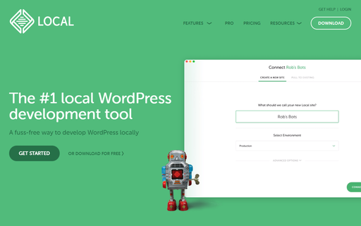

プラットフォームでWindowsを選択。

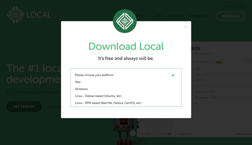

名前とメールアドレスと電話番号を入れろと出てくる。電話番号まで入れるのは怪しすぎるので空欄にしたらダウンロードが始まったからいらんっぽい。

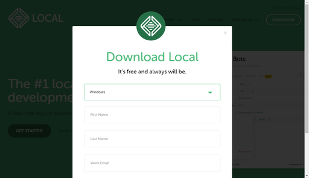

インストーラーが立ち上がって、適当にポチポチしたらインストール完了。

LOCALを立ち上げると、規約同意のあとエラーリポートをオンにするか聞かれる。お好きなように。

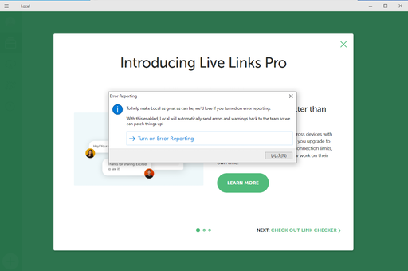

よく分からないアプリの宣伝をされるので、「×」をクリック。

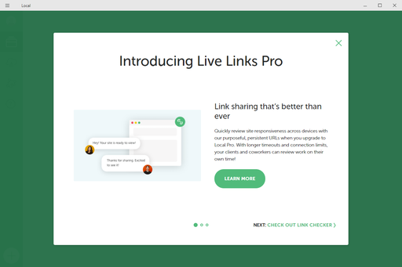

「まだサイトを作ってないようだね！」と表示されるので、「CREATE A NEW SITE」をクリック。

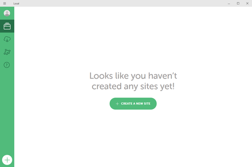

サイト名を聞かれる。ローカルテスト環境なので適当につける。

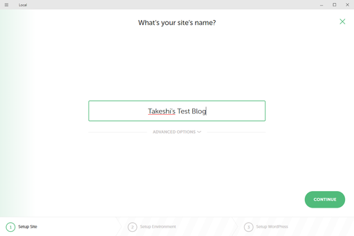

環境を選べと聞かれる。Customを選び、できるだけリモート環境に近いバージョンを構築する。

* PHP 7.3.5
* Nginx 1.16.0
* MariaDB 10.4.10

を選択。

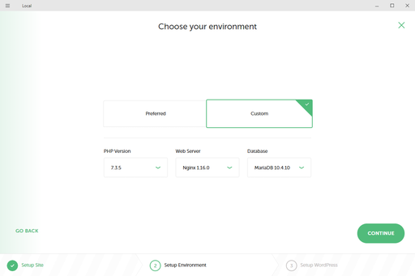

ローカルWordPress用のユーザー名とパスワードとメアドを聞かれる。メアドって入力する必要ある？とりあえずデフォルトで何か入っていたので、そのままにする。

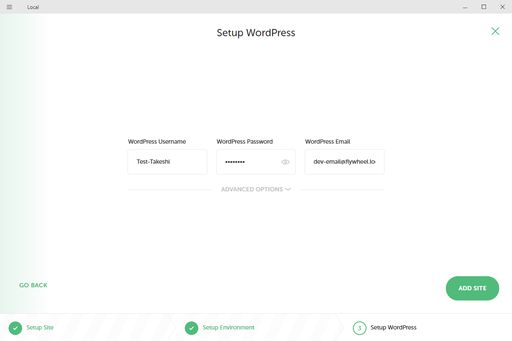

インストール中にWindowsがなんか色々聞いてくるけど、適当に許可。

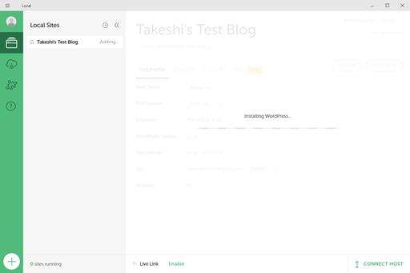

すぐインストールが終わった。VIEW SITEをクリックするとブラウザが立ち上がって今作ったWordPressが見れるらしい。

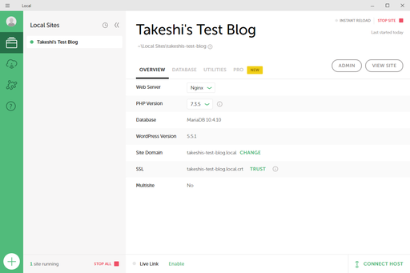

英語かよ。

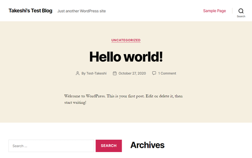

先の画面でADMINをクリックするとブラウザ上にログイン画面が表示される。

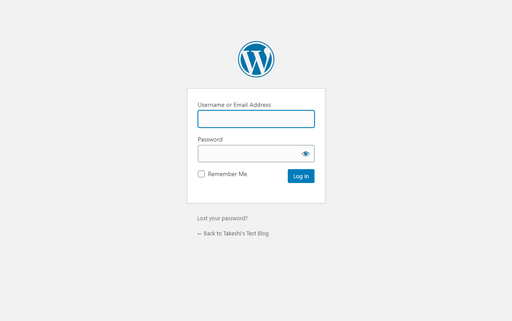

先のメニューでタイトルの下に小さく表示されているパスがどうもWordPressのインストール場所らしい。「＞」マークをクリック。

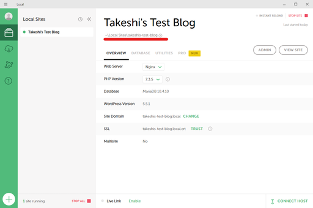

む、なんかちゃう。

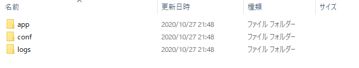

`app`→`public`と進めばWordPressのファイル群があった。この`wp-content`→`themes`の中に自作テーマを入れるとローカル環境でも管理画面で自作テーマが選べるはず。

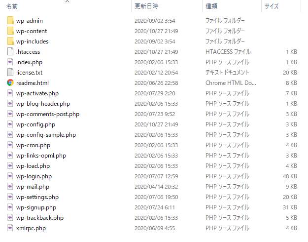

できた。相変わらずひどい。

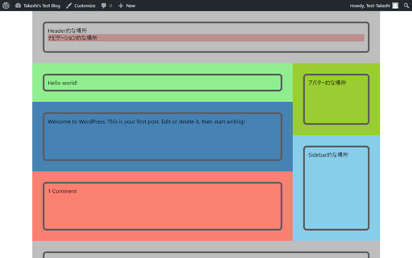

とりあえずこれでローカル上で確認してからアップするということができるようになった。