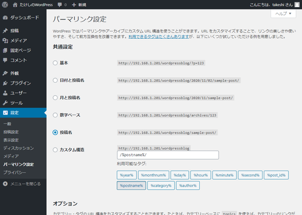
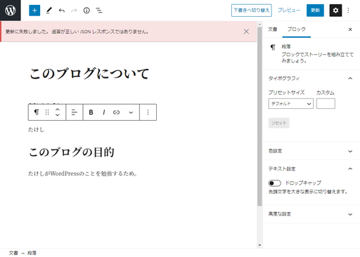

# パーマリンク設定を「基本」以外にすると記事が保存できなくなる問題

## 環境

- ローカル（PC側）
  - Windows10
  - PowerShell 5.1
- リモート（Raspberry Pi）
  - Raspberry Pi 3B+
  - Raspberry Pi OS 10.4
  - Nginx 1.14.2
  - PHP 7.3.19-1~deb10u1
  - WordPress 5.5.3-ja

## 症状

パーマリンク設定を「基本」以外に設定して、



記事（画像では固定ページ）を書き、パーマリンクを自分で設定して公開しようとすると「更新に失敗しました。返答が正しいJSONレスポンスではありません。」というエラーが出て公開できない。



## 解決方法

Nginxの設定ファイルを編集する。

~~~shell
$ sudo nano /etc/nginx/sites-available/default
~~~

`/wordpressblog`を指定した`location`ディレクティブを以下のようにして付け加える。

~~~
	location /wordpressblog {
		try_files $uri $uri/ /wordpressblog/index.php?$args;
	}
~~~

これでパーマリンクを編集できるようになる。


## 解説

ウチのWordPressはルートディレクトリにはインストールせず、ルートディレクトリの中に`wordpressblog`というディレクトリを作ってその中にインストールしている。

~~~
ドキュメントルート
　├他のディレクトリ
　├他のディレクトリ
　└wordpressblog
　　└WordPressのファイル群
~~~

なので、`location`ディレクティブでは`/wordpressblog`というパスを指定してあげないといけない。さらに、`/index.php?$args`を付け加えるんだけど、やっぱりここでも`/wordpressblog`を付けてあげて、WordPressをインストールしたディレクトリのトップにある`index.php`にパラメーターを投げるように上手く設定しないといけない。

おそらく多くの人はドキュメントルートに直接WordPressをインストールしていると思われるので、その場合は以下のように設定する。

~~~
		location / {
				try_files $uri $uri/ /index.php?$args;
		}
~~~

## 調査経緯

どうやって調査を進めたかの記録

---

[Solved\] Updating failed\. Error message: The response is not a valid JSON response\. \- WordPress 786](https://wordpress786.com/updating-failed-error-message-the-response-is-not-a-valid-json-response/)

ここが有力な情報源かと思われるが、

1. パーマリンクを再設定する。
2. もしnginx使っているなら、nginx（の設定ファイルと思われる）にwordpressルールが追加されていることを確かめる。もし追加されていないなら追加する。
3. ルールが追加された後、nginxを再起動する。

と書いてあって、wordpressルールというのが全く不明。

---

NginxでWordPressを使う時は、Nginxの設定をする必要があったらしい。やり方を説明しているサイトが以下。

[nginxの設定をWordPress用にしてみた \| ハックノート](https://hacknote.jp/archives/39227/)
[NginxでWordPressを使う時の設定をまとめてみた \| work\.log](https://worklog.be/archives/3222#Nginx-3)
[nginxでwordpressを動かすには \- Qiita](https://qiita.com/fk1/items/3ef1d989d1d5e44a1d03)

ただし、どれも「こうすればいいよ」と書いてあるけど「なぜそうすればいいのか」という解説までは書いていないので、自分の環境に合うのかどうか確認ができない。

---

[Nginx環境へWordPressをインストールする手順と注意点 パーマリンクに気を付ける \- レムシステム エンジニアブログ](https://www.rem-system.com/nginx-wp-inst/)

ダイレクトに今回の問題の解決方法になってそうなページを発見。

> パーマリンクに対応するために設定が必要なファイルは**"/etc/nginx/sites-available"**ディレクトリに含まれるバーチャルホスト用の設定ファイル**"ドメイン名.conf"**になります。

バーチャルホスト・・・　そんなこと意識してNginxやWordPressをインストールしていない。

---

[Nginx応用編①バーチャルホストを設定する。Linuxサーバ構築手順まとめ \| TECH Projin](https://tech.pjin.jp/blog/2014/11/01/nginx%E5%BF%9C%E7%94%A8%E7%B7%A8%E2%91%A0%E3%83%90%E3%83%BC%E3%83%81%E3%83%A3%E3%83%AB%E3%83%9B%E3%82%B9%E3%83%88%E3%82%92%E8%A8%AD%E5%AE%9A%E3%81%99%E3%82%8B%E3%80%82linux%E3%82%B5%E3%83%BC%E3%83%90/)

調べながらうすうす気づいていたけど、バーチャルホストとは例えば

* arcticstreet.ddns.net
* arcticstreet1.ddns.net
* arcticstreet2.ddns.net

など、複数のドメインでのアクセスを全部自宅のRaspberry Piにアクセスできるようにしたとき、ドメイン別に表示するHTMLファイルを変えたりすることができる機能。

---

[Nginxの設定ファイルについて勉強してきた](../webserver/index.html)けど、どうもこれはNginxの問題ではない。まず記事の保存ができないということで、ブロックエディタが悪さをしているらしい。

[How to Fix "the response is not a valid JSON response" Error in WordPress](https://wpbizblog.com/response-is-not-a-valid-json-response-error/)

確かにWordPressの管理画面でクラシックエディタプラグインをインストールして、エディタをクラシックエディタに変えるとパーマリンクを設定しつつ、記事を保存できた。

---

また別の問題が出現。固定ページのパーマリンクを`about`にして、`https://arcticstreet.ddns.net/wordpressblog/about`にアクセスすると、404が返ってくるようになった。

やっぱりNginxの問題も含んでいたのか？

---

再びこの記事へ戻る。

[Nginx環境へWordPressをインストールする手順と注意点 パーマリンクに気を付ける \- レムシステム エンジニアブログ](https://www.rem-system.com/nginx-wp-inst/)

>  パーマリンクに対応するために設定が必要なファイルは**"/etc/nginx/sites-available"**ディレクトリに含まれるバーチャルホスト用の設定ファイル**"ドメイン名.conf"**になります。

これは全ての環境に必ず存在するというわけではない。自分のRaspberry Piは`/etc/nginx/sites-available/default`に書けば良いことが分かった。（本当はバーチャルホスト毎に分けたらいいんだろうけど、今は不要）

以下、続きを読む。

> このlocationディレクティブに、以下の「try_files」設定を追加します。
>
> ```
> try_files $uri $uri/ /index.php?$args;
> ```
>
> これは要求されたURIにファイルかディレクトリが存在するかチェックして、存在しない場合はindex.php へリダイレクトするという設定です。

ということで、

~~~shell
$ sudo nano /etc/nginx/sites-available/default
~~~

で設定ファイルを開き、該当部分を修正。

~~~
        location / {
                # First attempt to serve request as file, then
                # as directory, then fall back to displaying a 404.
                try_files $uri $uri/ /index.php?$args;
        }
~~~

---

やっぱりうまくいかない。

というか、よく考えたら上の設定は間違ってるんじゃないか？というのも、`$uri`がダメで`$uri/`もダメなら、`https://arcticstreet.ddns.net/index.php?＋パラメーター`というようなアクセスになるのではないか。

普通は

~~~
ドキュメントルート
　└WordPressのファイル群
~~~

とするだろうけど、自分のように

~~~
ドキュメントルート
　├他のディレクトリ
　├他のディレクトリ
　└wordpressblog
　　└WordPressのファイル群
~~~

というような感じでドキュメントルートの下にディレクトリを作りそこにWordPressをインストールしたから、`location`ディレクティブは`/wordpressblog`を指定してやらないといけないんじゃないか。

という訳で以下のように修正。

~~~
        location / {
                # First attempt to serve request as file, then
                # as directory, then fall back to displaying a 404.
                try_files $uri $uri/ =404;　# 戻した
        }
        
        （略）
        
        location /wordpressblog {
        		try_files $uri $uri/ /index.php?$args;
        }
~~~

でもこれでもダメ。

---

ひょっとして、これでいけるのか？

~~~
        location /wordpressblog {
        		try_files $uri $uri/ /wordpressblog/index.php?$args;
        }
~~~

ビンゴ。


長かった。

結局この方法ならクラシックエディタを使わなくても大丈夫らしい。せっかくなのでブロックエディタに戻して、クラシックエディタはアンインストール。

## 参考

今回の解決の糸口になったページ。

[nginxでWordPressのパーマリンク形式変更にすると404](https://yuuchika.com/wp_nginx_404/)
[NginxでPHPを動かす](https://www.spiceworks.co.jp/blog/?p=12317)

## 気になった話題

調べていく最中に見つけた気になった話題。

### WordPress用のNginxの設定

もっといろいろ設定している。

[NginxでWordPressを使う時の設定をまとめてみた \| work\.log](https://worklog.be/archives/3222#Nginx-3)
[nginxの設定をWordPress用にしてみた \| ハックノート](https://hacknote.jp/archives/39227/)
[nginxでwordpressを動かすには \- Qiita](https://qiita.com/fk1/items/3ef1d989d1d5e44a1d03)

### WAF(Web Application Firewall)

ウェブアプリを守るためのファイアウォール。

[【WordPress】『更新に失敗しました。 エラーメッセージ: 返答が正しい JSON レスポンスではありません。』が表示される場合の対処法 \- webtoranomaki](https://webtoranomaki.com/wordpress/560/)
[Gutenberg『更新に失敗しました』の原因はだいたいWAF設定｜コーディングブログ｜tacs\-port](https://tacs-port.tech/blog/gutenberg/blog-144/)
[Gutenberg で「更新できません」「無効なjson・・・」と表示された時の原因 \- Qiita](https://qiita.com/toiee_kame/items/3111f7e49f3d6092abe9)

### WP REST API

WordPressが持つREST API。上の3サイトではどれも「新エディタGutenbergはWordPressのREST APIを使って記事を更新している」と指摘している。Gutenbergは評判が悪いけど、ひょっとしたらこの仕様が悪さしているのか？

[WordPress『WP REST API』\#1 ブログを他のサイトに埋め込む方法｜レンタルサーバーナレッジ](https://knowledge.cpi.ad.jp/cms/wp-rest-api/)
[WordPressのRESTAPIでユーザー名を取得できないようにしておく \| ウェブデザイン・ITエンジニアスクールをお探しならAkros\(アクロス\)｜東京\(台東区上野\)・全国オンライン](https://akros-ac.jp/11753/)
[WP REST API v2 Documentation](https://ja.wp-api.org/)

REST APIと言えばCORSで悩むと相場が決まっている（？）ので、将来のためにリンクだけ残しておく。

[なんとなく CORS がわかる\.\.\.はもう終わりにする。 \- Qiita](https://qiita.com/att55/items/2154a8aad8bf1409db2b)
[CORS \(Cross\-Origin Resource Sharing\) ってなに？](https://aloerina01.github.io/blog/2016-10-13-1)
[CORS とは？ \- JavaScript の基本 \- JavaScript 入門](https://javascript.keicode.com/newjs/what-is-cors.php)
[CORSの仕組みをGIFアニメで分かりやすく解説 \| コリス](https://coliss.com/articles/build-websites/operation/work/cs-visualized-cors.html)

